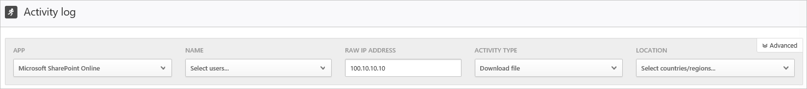

# Atividades

*Aplica-se a: Microsoft Cloud App Security*

O Microsoft Cloud App Security proporciona visibilidade de todas as atividades de seus aplicativos conectados. Depois de conectar o Cloud App Security a um aplicativo usando o Conector de aplicativos, o Cloud App Security examinará todas as atividades que ocorreram – o período de tempo de verificação retroativo é diferente de acordo com o aplicativo – e, em seguida, ele será constantemente atualizado com novas atividades.

> [!NOTE]
> Para obter uma lista completa de atividades do Office 365 monitoradas pelo Cloud App Security, veja [Pesquisar o log de auditoria no Centro de Conformidade e Segurança do Office 365](https://support.office.com/article/Search-the-audit-log-in-the-Office-365-Security-Compliance-Center-0d4d0f35-390b-4518-800e-0c7ec95e946c?ui=en-US&rs=en-US&ad=US#ID0EABAAA=Audited_activities)

O **Log de atividades** pode ser filtrado para permitir que você encontre atividades específicas. Crie políticas com base nas atividades e, em seguida, defina sobre o que você deseja ser alertado e agir. É possível pesquisar atividades realizadas em determinados arquivos. O tipo de atividades e as informações que recebemos para cada atividade dependem do aplicativo e do tipo de dados que ele pode fornecer.

Por exemplo, é possível usar o **Log de atividades** para encontrar usuários na sua organização que estejam usando sistemas operacionais ou navegadores desatualizados da seguinte maneira: depois de conectar um aplicativo ao Cloud App Security, na página **Log de atividades**, use o filtro avançado e selecione **Marcação do agente do usuário**. Em seguida, selecione **Navegador desatualizado** ou **Sistema operacional desatualizado**.

O filtro básico fornece excelentes ferramentas para começar a usar a filtragem de suas atividades.

Para fazer uma busca detalhada de atividades mais específicas, você pode expandir o filtro básico clicando em **Avançado**.

> [!NOTE]
> A marca Legacy é adicionada a qualquer política de atividade que use o filtro "usuário" mais antigo. Esse filtro continuará funcionando normalmente. Se quiser remover a marca Legacy, remova o filtro e adicione-o novamente usando o novo filtro **Nome de usuário**.

## A gaveta de atividades

### Trabalhando com a gaveta Atividade

Você pode exibir mais informações sobre cada atividade clicando na própria atividade no log de atividades. Isso abre a Gaveta de atividades, que fornece as seguintes ações adicionais e informações para cada atividade:
- Políticas correspondentes: clique no link Políticas correspondentes para ver uma lista de políticas nessa atividade correspondente.

- Exibir dados brutos: clique em Exibir dados brutos para ver os dados reais que foram recebidos do aplicativo.

- Usuário: clique no usuário para exibir a página do usuário que executou a atividade.

- Tipo de dispositivo: clique no tipo de dispositivo para exibir os dados brutos do agente do usuário.

- Local: clique no local para exibir o local no Bing Mapas.

- Marcas e categoria de endereço IP: clique na marca de IP para exibir a lista de marcas de IP encontradas nessa atividade. Em seguida, você pode filtrar por todas as atividades correspondentes nessa marca.

Os campos na gaveta Atividade fornecem links contextuais para atividades adicionais e análises detalhadas que você talvez queira executar diretamente na gaveta. Por exemplo, se você mover o cursor para próximo da categoria de endereço IP, pode usar o ícone para adicionar filtro  para adicionar o endereço IP imediatamente ao filtro da página atual. Você também pode usar o ícone de engrenagem de configurações  que aparece diretamente na página de configurações necessária para alterar a configuração de um dos campos, tais como **Grupos de usuários**.

Use os ícones na parte superior da guia para:
- Exibir atividades do mesmo tipo
- Exibir todas as atividades do mesmo usuário
- Exibir atividades do mesmo endereço IP
- Exibir atividades da mesma localização geográfica
- Exibir atividades do mesmo período de tempo (48 horas)

Para obter uma lista das ações de governança disponíveis, consulte [Ações de governança de atividade](governance-actions.md#activity-governance-actions).

#### Informações de usuário

A experiência de investigação inclui insights sobre o usuário em ação. Com um único clique, é possível obter uma visão abrangente do usuário, incluindo por meio de qual local ele se conectou, com quantos alertas em aberto ele está envolvido e suas informações de metadados.

Para exibir informações de usuário:

1. Clique na atividade em si no **Log de atividades**.

2. Em seguida, clique na guia **Usuário**.  
Clicar abre a Gaveta de atividades. A guia **Usuário** fornece os seguintes insights sobre o usuário:
    - **Abrir alertas**: o número de alertas abertos envolvendo o usuário.
    - **Corresponde**: ao número de correspondências de política para arquivos pertencentes ao usuário.
    - **Atividades**: o número de atividades executadas pelo usuário nos últimos 30 dias.
    - **Países**: o número de países dos quais o usuário se conectou nos últimos 30 dias.
    - **ISPs**: o número de ISPs dos quais o usuário se conectou nos últimos 30 dias.
    - **Endereços IP**: o número de endereços IP dos quais o usuário se conectou nos últimos 30 dias.

#### Informações sobre endereço IP

Como as informações de endereço IP são cruciais para quase todas as investigações, você pode exibir informações detalhadas sobre endereços IP na Gaveta de atividades. De dentro de uma atividade específica, você pode clicar na guia de endereço IP para exibir os dados consolidados sobre o endereço IP, incluindo o número de alertas abertos para o endereço IP específico, um gráfico de tendência de atividade recente e um mapa do local. Isso permite fazer uma busca detalhada ao investigar alertas de viagens impossíveis, por exemplo. É possível compreender facilmente onde o endereço IP foi usado e se estava envolvido em atividades suspeitas ou não. Você também pode executar ações diretamente na gaveta do endereço IP que permite que você marque um endereço IP como arriscado, VPN ou corporativo para facilitar a criação de políticas e a futura investigação.

Para exibir as informações sobre endereço IP:

1. Clique na atividade em si no **Log de atividades**.

2. Em seguida, clique na guia **Endereço IP**.  
Esse recurso abre a guia **Endereço IP** da gaveta de atividades, que fornece as seguintes informações sobre o endereço IP:
    - **Abrir alertas**: o número de alertas abertos envolvendo o endereço IP.
    - **Atividades**: o número de atividades executadas pelo endereço IP nos últimos 30 dias.
    - **Localização do IP**: as localizações geográficas a partir das quais o endereço IP foi conectado nos últimos 30 dias.
    - **Atividades**: o número de atividades executadas a partir do endereço IP nos últimos 30 dias.
    - **Atividades administrativas**: o número de atividades administrativas executadas a partir do endereço IP nos últimos 30 dias.
    - Você pode executar as seguintes ações de endereço IP:
        - Marcar como IP corporativo e adicionar à lista de permissões
        - Marcar como endereço IP de VPN e adicionar à lista de permissões
        - Marcar como IP arriscado e adicionar à lista bloqueada

   >[!NOTE]
   > Quando um endereço IP é marcado como corporativo, ele é refletido no portal e os endereços IP são excluídos de dispararem detecções específicas (por exemplo, viagem impossível), pois são considerados confiáveis.

## Exportar atividades 

Você pode exportar todas as atividades do usuário para um arquivo CSV.

No **Log de atividades**, no canto superior direito, clique no botão **Exportar**.

[!INCLUDE [Handle personal data](../includes/gdpr-intro-sentence.md)]

## Próximas etapas

> [!div class="nextstepaction"]
> [Atividades diárias para proteger seu ambiente de nuvem](daily-activities-to-protect-your-cloud-environment.md)

[!INCLUDE [Open support ticket](includes/support.md)]
