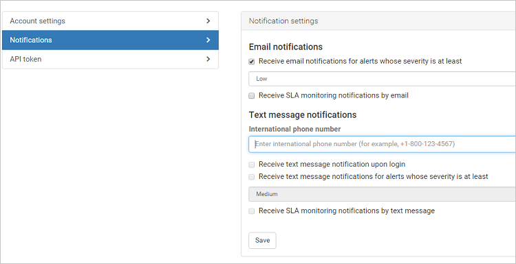

# Configurações do usuário administrador

*Aplica-se ao: Microsoft Cloud App Security*

O Microsoft Cloud App Security permite personalizar suas configurações de usuário administrador. As configurações de notificação permitem que os administradores especifiquem se eles desejam receber notificações por email ou texto para alertas.

## Personalizar suas configurações de administrador

Para configurar suas preferências como um administrador do Microsoft Cloud App Security, clique em seu nome na barra de menus do portal e selecione **Configurações de usuário** para definir as seguintes configurações:

1. Clique em **Configurações de conta**. Aqui você pode definir e renovar a senha de acesso para o portal do Cloud App Security.

    

2. Clique em **Notificações** e defina as preferências de notificação de email e texto para os emails recebidos do sistema.  Você pode definir a gravidade que determina para quais alertas e violações você deseja receber emails. A gravidade é definida por política. Quando as violações forem disparadas, você receberá uma notificação por email dependendo da configuração daqui e da configuração de Gravidade na política que foi violada. Os emails são enviados para o alias associado à conta de usuário do administrador usada para entrar no Cloud App Security. Insira um número de telefone para permitir que o Cloud App Security envie mensagens de texto quando alertas e notificações forem enviados e defina o nível de gravidade para o qual você deseja receber notificações por mensagem de texto.

    > [!NOTE]
    > O número máximo de alertas enviados por meio de mensagem de texto é 10 por número de telefone por dia. O dia é calculado de acordo com o fuso horário UTC.

    

3. Quando terminar, clique em **Salvar**.

## Próximas etapas

> [!div class="nextstepaction"]
> [Configurar o Cloud Discovery](set-up-cloud-discovery.md)

[!INCLUDE [Open support ticket](includes/support.md)]
