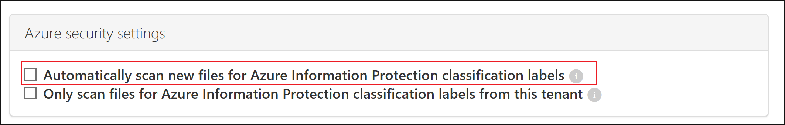
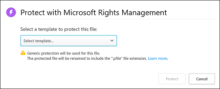

# Integração à Proteção de Informações do Azure

*Aplica-se a: Microsoft Cloud App Security*

O Microsoft Cloud App Security permite aplicar rótulos de classificação da Proteção de Informações do Azure automaticamente, com ou sem proteção, a arquivos como uma ação de governança da política de arquivo. Também é possível investigar arquivos com a filtragem do rótulo de classificação aplicado no portal do Cloud App Security. O uso de classificações proporciona mais visibilidade e controle sobre os dados confidenciais na nuvem. A integração de Proteção de Informações do Azure ao Cloud App Security é tão fácil quanto marcar uma única caixa de seleção.

> [!NOTE]
> Este artigo também é relevante para rótulos de sensibilidade unificada do Office 365 se você já tiver [migrado seus rótulos de classificação para o centro de conformidade e segurança do office 365](/azure/information-protection/configure-policy-migrate-labels). Se você não migrou os rótulos de classificação existentes e começa a criar novos rótulos no centro de conformidade e segurança do Office 365, Cloud App Security usará somente os rótulos preexistentes configurados no portal da proteção de informações do Azure.

Integrando a Proteção de Informações do Azure ao Cloud App Security, é possível usar todo o potencial dos dois serviços e proteger arquivos na nuvem, incluindo:

- A capacidade de aplicar rótulos de classificação como uma ação de governança a arquivos que correspondem a políticas específicas
- A capacidade de exibir todos os arquivos classificados em um local central
- A capacidade de investigar de acordo com o nível de classificação e de quantificar a exposição de dados confidenciais sobre os aplicativos de nuvem
- A capacidade de criar políticas para garantir que os arquivos confidenciais sejam tratados corretamente

> [!NOTE]
> Para habilitar esse recurso, você precisa de uma licença do Cloud App Security e de uma licença da Proteção de Informações do Azure Premium P1. Assim que as duas licenças estiverem em vigor, o Cloud App Security sincronizará os rótulos das organizações do serviço Proteção de Informações do Azure.

## Pré-requisitos

- Para trabalhar com a integração da Proteção de Informações do Azure, habilite o [Conector de aplicativos para o Office 365](connect-office-365-to-microsoft-cloud-app-security.md).

Para usar rótulos no Cloud App Security, os rótulos devem ser publicados como parte da política. Se você estiver usando a proteção de informações do Azure, os rótulos deverão ser publicados por meio do portal da proteção de informações do Azure. Se você migrou para rótulos unificados, os rótulos devem ser publicados por meio do centro de conformidade e segurança do Office 365.

Atualmente, o Cloud App Security permite a aplicação de rótulos de classificação da Proteção de Informações do Azure para os seguintes tipos de arquivo:

- Word: docm, docx, dotm, dotx
- Excel: xlam, xlsm, xlsx, xltx
- PowerPoint: potm, potx, ppsx, ppsm, pptm, pptx
- PDF
  > [!NOTE]
  > Para PDF, você deve usar rótulos unificados.

Atualmente, este recurso está disponível para arquivos armazenados nas plataformas Box, G Suite, SharePoint Online e OneDrive for Business. Mais aplicativos de nuvem serão compatíveis em versões futuras.

Os arquivos que foram rotulados com proteção fora do Cloud App Security não podem ser alterados pelo Cloud App Security. No entanto, você pode verificar esses arquivos concedendo permissões para [inspecionar o conteúdo de arquivos protegidos](content-inspection.md#content-inspection-for-protected-files).

## Como ele funciona

Provavelmente, você já conhece os rótulos de classificação de arquivos da [Proteção de Informações do Azure](/azure/information-protection/what-is-information-protection). As marcações de classificação da Proteção de Informações do Azure são exibidas no Cloud App Security. Assim que você integrar o Cloud App Security à Proteção de Informações do Azure, o Cloud App Security verificará os arquivos da seguinte maneira:

1. O Cloud App Security recupera a lista de todos os rótulos de classificação usados em seu locatário. Esta ação é executada a cada hora para manter a lista atualizada.

2. Em seguida, o Cloud App Security verifica os arquivos quanto aos rótulos de classificação, da seguinte maneira:

    - Se você tiver habilitado a verificação automática, todos os arquivos novos ou modificados serão adicionados à fila de verificação e todos os arquivos e repositórios existentes serão verificados.
    - Se você definir uma política de arquivo para pesquisar rótulos de classificação, esses arquivos serão adicionados à fila de verificação para rótulos de classificação.

3. Conforme descrito acima, essas verificações se destinam a rótulos de classificação descobertos na verificação inicial que o Cloud App Security executa para identificar quais rótulos de classificação são usados no locatário. Rótulos externos, ou seja, rótulos de classificação definidos por alguém externo ao seu locatário, são adicionados à lista de rótulos de classificação. Se você prefere não verificar esses rótulos, marque a caixa de seleção **Verificar apenas os arquivos dos rótulos de classificação da Proteção de Informações do Azure deste locatário**.

4. Depois de habilitar a proteção de informações do Azure no Cloud App Security, todos os novos arquivos adicionados aos seus aplicativos de nuvem conectados serão verificados em busca de rótulos de classificação.

5. Crie novas políticas no Cloud App Security que aplicam os rótulos de classificação automaticamente.

## Como integrar a Proteção de Informações do Azure ao Cloud App Security

### Habilitar a Proteção de Informações do Azure

Tudo que você precisa fazer para integrar a Proteção de Informações do Azure ao Cloud App Security é marcar uma única caixa de seleção. Habilitando a verificação automática, você habilita a pesquisa de rótulos de classificação da Proteção de Informações do Azure nos arquivos do Office 365, sem a necessidade de criar uma política. Depois de habilitar esse recurso, se houver arquivos no ambiente de nuvem que estejam marcados com rótulos de classificação da Proteção de Informações do Azure, eles serão exibidos no Cloud App Security.

Para permitir que o Cloud App Security verifique arquivos com a inspeção de conteúdo habilitada para rótulos de classificação:

1. No Cloud App Security, na engrenagem de configurações, selecione a página **Configurações** no título **Sistema**.

    
1. Em **Proteção de Informações do Azure**, selecione **Verificar automaticamente novos arquivos para os rótulos de classificação da Proteção de Informações do Azure**.

    

Depois de habilitar a Proteção de Informações do Azure, os arquivos com rótulos de classificação serão exibidos e você poderá filtrá-los por rótulo no Cloud App Security. Quando o Cloud App Security estiver conectado ao aplicativo de nuvem, você poderá usar os recursos de integração da Proteção de Informações do Azure para aplicar os rótulos de classificação deste serviço (com ou sem proteção) no portal Cloud App Security, adicionando-os diretamente aos arquivos ou configurando uma política de arquivo para aplicar rótulos de classificação automaticamente como uma ação de governança.

> [!NOTE]
> A verificação automática não verifica arquivos existentes até que eles sejam modificados novamente. Para verificar os arquivos existentes dos rótulos de classificação da proteção de informações do Azure, você deve ter pelo menos uma **política de arquivo** que inclua a inspeção de conteúdo. Se você não tiver nenhum, crie uma nova **política de arquivo**, exclua todos os filtros predefinidos, em método de **inspeção** , selecione **DLP interno**. No campo **inspeção de conteúdo** , selecione **incluir arquivos que correspondam a uma expressão predefinida** e selecione qualquer valor predefinido e salve a política. Isso permite a inspeção do conteúdo, que detecta automaticamente os rótulos de classificação da Proteção de Informações do Azure.

#### Definir marcações internas e externas

Por padrão, o Cloud App Security verifica rótulos de classificação que foram definidos pela organização, bem como rótulos externos que foram definidos por outras organizações.

Para ignorar o conjunto de rótulos de classificação de fora da organização, acesse o portal Cloud App Security, vá para **Configurações** e **Proteção**. Selecione **Verificar apenas os arquivos dos rótulos de classificação e os avisos de inspeção de conteúdo da Proteção de Informações do Azure deste locatário**.

### Aplicar rótulos diretamente a arquivos

1. Na página **Arquivos**, vá até **Investigar** e selecione o arquivo que você deseja proteger. Clique nos três pontos, no final da linha do arquivo, e escolha **Aplicar rótulo de classificação**.

    

    >[!NOTE]
    > O Cloud App Security pode aplicar a Proteção de Informações do Azure em arquivos de até 50 MB.

2. Você deve escolher um dos rótulos de classificação da organização que será aplicado ao arquivo e clicar em **Aplicar**.

    

3. Depois de escolher um rótulo de classificação e clicar em Aplicar, o Cloud App Security aplicará o rótulo de classificação ao arquivo original.

4. Também remova rótulos de classificação escolhendo a opção **Remover rótulo de classificação**.

> [!NOTE]
> É possível remover rótulos apenas quando eles não incluem proteção e são aplicados no Cloud App Security, exceto os aplicados diretamente na Proteção de Informações.

Para obter mais informações sobre como Cloud App Security e a proteção de informações do Azure funcionam em conjunto, consulte [aplicar automaticamente rótulos de classificação da proteção de informações do Azure](use-case-information-protection.md).

### Rotular arquivos automaticamente

Aplique rótulos de classificação a arquivos automaticamente criando uma política de arquivo e configurando **Aplicar rótulo de classificação** como a ação de governança.

Siga estas instruções para criar a política de arquivo:

1. Criar uma política de arquivo.
2. Defina a política para incluir o tipo de arquivo que deseja detectar. Por exemplo, selecione todos os arquivos em que o **Nível de acesso** seja diferente de **Interno**, e em que a **UO do Proprietário** seja igual em relação à equipe de finanças.
3. Nas ações de governança do aplicativo em questão, clique em **Aplicar rótulo de classificação** e selecione o tipo de rótulo.

    

> [!NOTE]
> A capacidade de aplicar automaticamente um rótulo de Proteção de Informações do Azure por meio da política de arquivo é um recurso poderoso. Para proteger os clientes da aplicação por engano de um rótulo a uma grande quantidade de arquivos, como precaução de segurança há um limite diário de 100 ações **Aplicar rótulo** por aplicativo, por locatário. Depois que o limite diário for atingido, a ação de aplicar rótulo pausa temporariamente e continua automaticamente no próximo dia (após 12h UTC). Para aumentar o limite do seu locatário, abra um tíquete de suporte.

### Controlar a exposição de arquivo

- Por exemplo, se o documento abaixo foi marcado com um rótulo de classificação da Proteção de Informações do Azure:

    

- É possível exibir o documento no Cloud App Security, filtrando-o no rótulo de classificação da Proteção de Informações do Azure, na página **Arquivos**.

    

- Saiba mais sobre esses arquivos e os respectivos rótulos de classificação na gaveta do arquivo. Clique no arquivo em questão, na página **Arquivos**, e veja se ele já tem um rótulo de verificação.

    

- Em seguida, você pode criar políticas de arquivo no Cloud App Security para controlar arquivos que são compartilhados inadequadamente e localizar arquivos rotulados que foram modificados recentemente.

- Crie uma política que aplique automaticamente um rótulo de classificação a arquivos específicos.
- Você pode também acionar alertas sobre atividades relacionadas à classificação de arquivos.

> [!Note]
> Quando os rótulos de Proteção de Informações do Azure estiverem desabilitados em um arquivo, os rótulos desabilitados serão exibidos como desabilitados no Cloud App Security. Rótulos excluídos não são exibidos.

**Política de exemplo – dados confidenciais externamente compartilhados no Box:**

1. Criar uma política de arquivo.
2. Defina o nome, a severidade e a categoria da política.
3. Adicionar os seguintes filtros para localizar todos os dados confidenciais que são externamente compartilhados no Box:

    

**Política de exemplo – dados restritos que recentemente foram modificados fora da pasta Finanças no SharePoint:**

1. Criar uma política de arquivo.
2. Defina o nome, a severidade e a categoria da política.
3. Adicione os filtros a seguir para encontrar todos os arquivos restritos modificados recentemente e exclua a pasta Finanças, na opção de seleção de pasta:

    

Você também pode optar por definir alertas, notificação do usuário ou tomar ação imediata para essas políticas.
Saiba mais sobre [ações de governança](governance-actions.md).

Saiba mais sobre [Proteção de Informações do Azure](/information-protection/understand-explore/what-is-information-protection) e confira o [tutorial de Início Rápido](/information-protection/get-started/infoprotect-quick-start-tutorial) da Proteção de Informações do Azure.

## Próximas etapas

> [!div class="nextstepaction"]
> [Controlar aplicativos de nuvem com políticas](control-cloud-apps-with-policies.md)

## Vídeos relacionados

> [!div class="nextstepaction"]
> [Integrações do Cloud App Security + Proteção de Informações do Azure](https://channel9.msdn.com/Shows/Microsoft-Security/MCAS--AIP-Integrations)

[!INCLUDE [Open support ticket](includes/support.md)]
