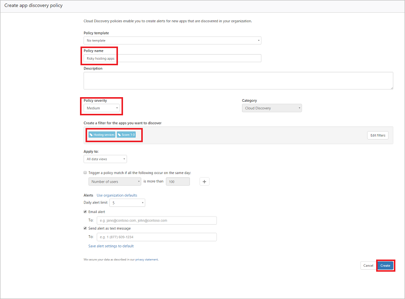

# Políticas de Cloud Discovery
    
## Criando uma política de descoberta de aplicativos  
As políticas de descoberta permitem que você defina alertas que notificam quando novos aplicativos são detectados na sua organização.  
  
1.  No console, clique em **Controlar** seguido por **Políticas**.  
  
2.  Clique em **Criar política** e selecione a política **Descoberta de aplicativos**.  
  
       
  
3.  Atribua um nome e uma descrição à sua política. Se desejar, poderá baseá-la em um modelo. Para obter mais informações sobre modelos de política, consulte [Controlar aplicativos de nuvem com políticas](control-cloud-apps-with-policies.md).  
  
4.  Para definir quais aplicativos descobertos vão disparar essa política, clique em **Adicionar filtros**.  
  
     Os filtros são escolhidos do lado esquerdo da página do pop-up de filtro. É possível filtrar por **Nome do aplicativo**, **Domínio**, **Fator de risco**, **Pontuação de risco** e **Categoria**. O lado direito da página mostrará os resultados para os filtros escolhidos no catálogo de serviço atual. Depois de escolher os filtros, salve e verifique se as marcas apropriadas aparecem na caixa de filtros.  
  
5.  Em **Aplicar a** escolha se isso se aplica a **Usuários**, **Endereços IP** ou ambos.  
  
6.  Defina o **Daily usage threshold (Limite de uso diário)** que o aplicativo deve atender para corresponder à política.  
  
7.  Defina um **Limite diário de alertas** e selecione se o alerta será enviado como um email, uma mensagem de texto ou ambos e forneça detalhes conforme necessário. Você pode clicar em Salvar configurações de alerta para o padrão para habilitar políticas futuras para salvar essas configurações de alerta, incluindo o número de telefone e os endereços de email, como o padrão.  
  
8.  Clique em **Criar**.  
  
Por exemplo, se você estiver interessado em descobrir aplicativos de hospedagem arriscados em seu ambiente de nuvem, defina sua política da seguinte forma:  
  
Defina os filtros de política para descobrir todos os serviços encontrados na categoria **serviços de hospedagem** e que tenham uma pontuação baixa, indicando que são arriscados.   
Defina a **Gravidade** da política como **Média**.   
Na parte inferior, defina os limites que devem disparar um alerta para um determinado aplicativo descoberto. Apenas se mais de 100 usuários no ambiente usaram o aplicativo e apenas se eles baixaram uma determinada quantidade de dados do serviço.   
Além disso, você pode definir o limite de alertas diários que deseja receber.  
  
  
  
## Detecção de anomalias do Cloud Discovery  
O Cloud App Security pesquisa todos os logs em seu Cloud Discovery quanto a anomalias. Por exemplo, quando um usuário que nunca usou o Dropbox antes de repente carrega 600 GB para o Dropbox ou quando há muito mais transações que o normal em um aplicativo específico. Por padrão, a política de detecção de anomalias está habilitada, portanto, não é necessário configurar uma nova política para ela funcionar, mas você pode ajustar sobre quais tipos de anomalias deseja ser alertado na política padrão.  
  
1.  No console, clique em **Controlar** seguido por **Políticas**.  
  
2.  Clique em **Criar política** e selecione **Política de detecção de anomalias de Cloud Discovery**.  
  
       
  
3.  Atribua um nome e uma descrição à sua política. Se desejar, poderá baseá-la em um modelo. Para obter mais informações sobre modelos de política, consulte [Controlar aplicativos de nuvem com políticas](control-cloud-apps-with-policies.md).  
  
4.  Para definir quais aplicativos descobertos vão disparar essa política, clique em **Adicionar filtros**.  
  
     Os filtros são escolhidos do lado esquerdo da página do pop-up de filtro. É possível filtrar por nome do serviço, domínio, fator de risco, pontuação de risco e categoria. O lado direito da página mostrará os resultados para os filtros escolhidos no catálogo de serviço atual. Depois de escolher os filtros, salve e verifique se as marcas apropriadas aparecem na caixa de filtros.  
  
5.  Em **Aplicar a**, escola se isso se aplica a **Todas as exibições de dados** ou a **Exibições de dados específicas** e se isso se aplica a **Usuários**, **Endereços IP** ou ambos.  
  
6.  Selecione as datas durante as quais a atividade anômala ocorreu para disparar o alerta em **Gerar alertas apenas para atividades suspeitas que ocorrerem após a data.**  
  
7.  Em **Alertas**, você pode definir a sensibilidade de detecção de anomalias de baixa a alta para configurar a frequência de alertas que você deseja receber.  
Defina um **Limite diário de alertas** e selecione se o alerta será enviado como um email, uma mensagem de texto ou ambos e forneça detalhes conforme necessário. Você pode clicar em Salvar configurações de alerta para o padrão para habilitar políticas futuras para salvar essas configurações de alerta, incluindo o número de telefone e os endereços de email, como o padrão. Você também pode clicar em **Usar padrões da organização** para definir essas configurações de acordo com o padrão para sua organização.  
  
9. Clique em **Criar**.  
  
  
  
## Veja também  
[Políticas de atividade de usuário](user-activity-policies.md)   
[Para obter suporte técnico, visite a página de suporte assistido do Cloud App Security.](http://support.microsoft.com/oas/default.aspx?prid=16031)   
[Os clientes Premier também podem escolher o Cloud App Security diretamente no Portal Premier.](https://premier.microsoft.com/)  
  
  