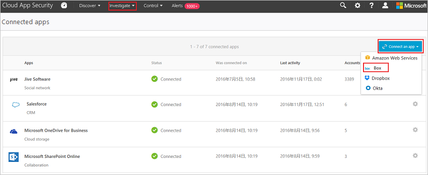

# Conectar caixa a Microsoft Cloud App Security

*Aplica-se a: Microsoft Cloud App Security*

Este artigo fornece instruções para conectar Microsoft Cloud App Security à sua conta de caixa existente usando as APIs do conector de aplicativo. Essa conexão fornece visibilidade e controle sobre o uso da caixa. Para obter informações sobre como Cloud App Security proteger a caixa, consulte [proteger caixa](protect-box.md).

## Como conectar a caixa ao Cloud App Security

> [!NOTE]
> A implantação com uma conta que não é uma conta de administrador leva a uma falha no teste de API e não permite que Cloud App Security Verifique todos os arquivos no box. Se esse for um problema para você, você poderá implantar com um coadministrador que tenha todos os privilégios verificados, mas o teste de API continuará a falhar e os arquivos pertencentes a outros administradores no box não serão verificados.

1. Se você restringir o acesso de permissão do aplicativo, siga esta etapa. Caso contrário, pule para a etapa 2.

    1. Entre com uma conta de administrador na sua conta do box.
    1. Clique nos **aplicativos** > **configurações**de > de **aplicativos personalizados** .

         

    1. Se **desabilitar aplicativos não publicados por padrão** estiver selecionado, na caixa de texto **exceto para** , adicione a chave de API de Cloud app Security:

         |Data Center|Chave de API de Cloud App Security|
         |----|----|
         |US1|`nduj1o3yavu30dii7e03c3n7p49cj2qh`|
         |DOS EUA 2|`w0ouf1apiii9z8o0r6kpr4nu1pvyec75`|
         |US3|`dmcyvu1s9284i2u6gw9r2kb0hhve4a0r`|
         |EU1|`me9cm6n7kr4mfz135yt0ab9f5k4ze8qp`|
         |EU2|`uwdy5r40t7jprdlzo85v8suw1l4cdsbf`|

        Em seguida, clique em **Salvar**. Para obter informações sobre como ver a quais Cloud App Security data center você está conectado, consulte [exibir seus data center](network-requirements.md#view-your-data-center).

        

        > [!NOTE]
        > Se você for um cliente Adallom existente e a URL do console for para Adallom e não Cloud App Security, use este número de série do aplicativo: `bwahmilhdlpbqy2ongkl119o3lrkoshc`.

2. No portal de Cloud App Security, clique em **investigar** e em **aplicativos conectados**.

3. Na página **conectores de aplicativos** , clique no botão de sinal de adição e selecione **caixa**.

    

4. No pop-up **configurações do box** , clique em **seguir este link**.

5. A página de entrada do Box é aberta. Insira suas credenciais para permitir que Cloud App Security acesso ao aplicativo de caixa da sua equipe.

6. Box pergunta se você deseja permitir Cloud App Security acesso às informações da sua equipe, ao log de atividades e executar atividades como um membro da equipe. Para continuar, clique em **Permitir**.

7. De volta ao portal de Cloud App Security, você deve receber uma mensagem dizendo que a caixa foi conectada com êxito.

8. Certifique-se de que a conexão foi bem-sucedida clicando em **Testar API**.

    O teste pode levar alguns minutos. Depois de receber um aviso de êxito, clique em **fechar**.

A caixa agora está conectada a Cloud App Security.

Após a caixa de conexão, você receberá eventos de 60 dias antes da conexão.

Após a caixa de conexão, Cloud App Security executa uma verificação completa. Dependendo de quantos arquivos e usuários você tem, concluir a verificação completa pode levar algum tempo. Para habilitar a verificação quase em tempo real, os arquivos nos quais as atividades são detectadas são movidos para o início da fila de verificação. Por exemplo, um arquivo que é editado, atualizado ou compartilhado é verificado imediatamente, em vez de aguardar o processo de verificação regular. A verificação quase em tempo real não se aplica a arquivos que não são modificados de forma inerente. Por exemplo, os arquivos que são exibidos, visualizados, impressos ou exportados são verificados como parte da verificação agendada regularmente.

Se você tiver problemas para conectar o aplicativo, consulte [Solucionando problemas de conectores de aplicativos](troubleshooting-api-connectors-using-error-messages.md).

## Próximas etapas

> [!div class="nextstepaction"]
> [Controlar aplicativos de nuvem com políticas](control-cloud-apps-with-policies.md)

[!INCLUDE [Open support ticket](includes/support.md)]
