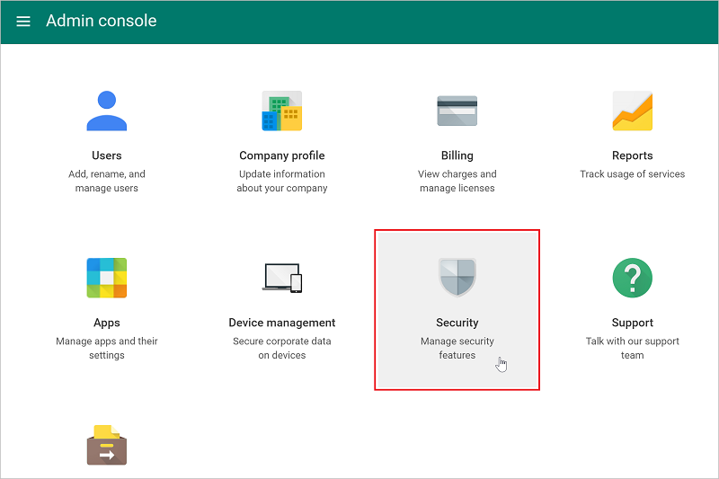

# Conectar o G Suite ao Microsoft Cloud App Security
Esta seção fornece instruções para conectar o Cloud App Security à sua conta do G Suite existente usando as APIs do conector.

  
  
## Configurar G Suite  
  
1.  Como um Superadministrador do G Suite, faça logon em [https://cloud.google.com/console/project](https://cloud.google.com/console/project).  
  
2.  Clique em **Criar projeto** para iniciar um novo projeto.  
  
       
  
3.  Na tela **Novo projeto**, nomeie o projeto da seguinte maneira: 
    **Microsoft Cloud App Security** e clique em **Criar**.  
             
  
4.  Depois que o projeto é criado, na barra de ferramentas, ao lado de Google Cloud Platform, selecione o projeto e, em **API**, clique **Ir para visão geral de APIs**.  
  
       
  
5.  Em **API**, desabilite todas as APIs listadas.  
      
6.  Clique em **Biblioteca** e habilite as seguintes APIs (use a linha de pesquisa se a API não aparecer na lista **APIs Populares**):  
  
       
  
    > [!NOTE]  
    >  Ignore o aviso **Credentials (Credenciais)** por enquanto.  
  
    -   Admin SDK (SDK de Administração)  
  
    -   Audit API (API de Auditoria)  
  
    -   API do Google Drive  
  
    -   Google Apps Marketplace SDK (SDK do Google Apps Marketplace)  
  
    -   Gmail API (API do Gmail)  
            
7.  Você deve ter cinco **Enabled APIs (APIs Habilitadas)**:  
  
       
  
8.  Clique em **Credentials (Credenciais)** seguido da **tela OAuth consent (Consentimento OAuth)**  
  
    -   Em **Product name shown to users (Nome do produto mostrado aos usuários)**, digite **Microsoft Cloud App Security**.  
  
    -   Todos os outros campos são opcionais.  
  
    -   Clique em **Salvar**.  
  
       
  
9. Na tela **Credenciais de API**, clique na sexta ao lado de **Criar credenciais**.  
  
       

10. Selecione **Chave de conta de serviço**.

       
  
11. Em **Criar chave de conta de serviço**, escolha **Nova conta de serviço** e digite qualquer nome, por exemplo **Conta de serviço 1**, em **Função**, escolha **Projeto** e, em seguida, **Editor** e, em **Tipo de chave**, escolha **P12** e clique em **Criar**. Marque a caixa de seleção **Habilitar a delegação em todo o domínio do G Suite** e clique em **Salvar**.  
  
       
  
12.  Um arquivo de certificado P12 será salvo no seu computador.  
        
12. Na tela **Credentials (Credenciais)**, clique em **Manage service accounts (Gerenciar contas de serviço)** na extrema direita.  
         
  
13. Clique nos três pontos à direita da conta de serviço que você criou e selecione **Edit (Editar)**.  
  
       
  
15. Copie a **ID da conta de serviço** atribuída ao seu serviço, você precisará dela mais tarde.  
  
       
  
16. Abra o menu do Google clicando nas três linhas horizontais ao lado deGoogle Cloud Platform na barra de título e selecione **API manager (Gerenciador de API)** seguido por **Dashboard (Painel)**.  
    
17. Role para baixo até a lista de APIs habilitadas e clique no ícone de engrenagem de configurações ao lado de **API do Google Drive**.   
         

18. Preencha o seguinte:

    -   **Application Name (Nome do Aplicativo)**: Microsoft Cloud App Security.  
  
    -   **Short Description & Long Description (Descrição curta e descrição longa)** (opcional): o Microsoft Cloud App Security fornece a visibilidade dos aplicativos de nuvem, ajudando a controlar, investigar e administrar o uso do aplicativo de nuvem, proteger dados corporativos e detectar atividades suspeitas para qualquer aplicativo de nuvem.  
  
    -   O Google exige que você carregue pelo menos um ícone do aplicativo. Vá para [https://portal.cloudappsecurity.com/cas/static/files/MSLogos.zip](https://portal.cloudappsecurity.com/cas/static/files/MSLogos.zip) para baixar um arquivo zip que contém os ícones do Cloud App Security. Em seguida, em **Application icon (Ícone do aplicativo)**, arraste e solte as imagens 128x128 e 32x32.  
  
    -   Em **Integração de Unidade**, digite o seguinte em **Abrir URL:**  
  
         https://portal.cloudappsecurity.com/#/services/11770?tab=files  
     
           
  
19. Na lista **Enabled APIs (APIs Habilitadas)**, clique na engrenagem de configuração ao lado de **Google Apps Marketplace SDK (SDK do Google Apps Marketplace)**. 
           

       >[!NOTE]
       > Se a engrenagem estiver desabilitada, você poderá clicar em **Google Apps Marketplace SDK (SDK do Google Apps Marketplace)**. 
20. Selecione a guia **Configuração**. 
  
    -   Copie o **Número do projeto (ID do Aplicativo)** que aparece na parte superior para usar mais tarde.  
  
    -   O **Application Name (Nome do Aplicativo)** deve informar **Microsoft Cloud App Security**.
  
         Preencha o campo **Application description (Descrição do aplicativo)** com “O Microsoft Cloud App Security fornece visibilidade dos aplicativos de nuvem, ajudando a controlar, investigar e administrar o uso do aplicativo de nuvem, proteger dados corporativos e detectar atividades suspeitas para qualquer aplicativo de nuvem”.  
  
    -   Desmarque a caixa de seleção **Enable individual install (Habilitar instalação individual)**.  
  
    -   Configurar as quatro imagens necessárias em **Application icons (Ícones de aplicativo)**.  
  
         As imagens podem ser encontradas em: [https://portal.cloudappsecurity.com/cas/static/files/MSLogos.zip](https://portal.cloudappsecurity.com/cas/static/files/MSLogos.zip)  
  
           
  
    -   Preencha as seguintes **Support URLs (URLs de suporte)**:  
  
        -   **URL dos Termos de Serviço**: http://go.microsoft.com/fwlink/?LinkID=733268  
  
        -   **URL da Política de Privacidade**: http://go.microsoft.com/fwlink/?LinkId=512132  
  
    -   Em **Escopos OAuth 2.0**, copie e cole o seguinte. Você deve copiá-los um por vez e pressionar Enter após cada um:  
  
           https://www.googleapis.com/auth/admin.reports.audit.readonly  
  
           https://www.googleapis.com/auth/admin.reports.usage.readonly  
  
           https://www.googleapis.com/auth/drive  
  
           https://www.googleapis.com/auth/drive.appdata  
  
           https://www.googleapis.com/auth/drive.apps.readonly  
  
           https://www.googleapis.com/auth/drive.file  
  
           https://www.googleapis.com/auth/drive.metadata.readonly  
  
           https://www.googleapis.com/auth/drive.readonly  
  
           https://www.googleapis.com/auth/drive.scripts  
  
           https://www.googleapis.com/auth/admin.directory.user.readonly  
  
           https://www.googleapis.com/auth/admin.directory.user.security  
  
           https://www.googleapis.com/auth/admin.directory.user.alias  
  
           https://www.googleapis.com/auth/admin.directory.orgunit  
  
           https://www.googleapis.com/auth/admin.directory.notifications  
  
           https://www.googleapis.com/auth/admin.directory.group.member  
  
           https://www.googleapis.com/auth/admin.directory.group  
  
           https://www.googleapis.com/auth/admin.directory.device.mobile.action  
  
           https://www.googleapis.com/auth/admin.directory.device.mobile  
  
           https://www.googleapis.com/auth/admin.directory.user  
  
    -   Clique em **Save Changes (Salvar Alterações)**.  
  
18. Vá para [admin.google.com](https://admin.google.com/) e, em seguida, escolha **Segurança**. 
         
 
19. Selecione **API reference (Referência da API)**.  
         
      
20. Selecione **Enable API Access (Habilitar acesso à API)** e clique em **Save changes (Salvar alterações)**.  
  
      

  
## Configurar o Microsoft Cloud App Security  
  
1.  No portal do Cloud App Security, clique em **Investigar** e em **Aplicativos conectados**.  
  
2.  Na página **Aplicativos conectados**, clique no sinal de mais e selecione **G Suite**.  
       
  
3.  No pop-up, preencha o seguinte:  
  
       
  
    1.  **Service Account email address (Endereço de email da conta de serviço)** que você copiou na etapa 16.  
  
    2.  **Número do projeto (ID do aplicativo)** que você copiou na etapa 21.  
  
    3.  Carregue o **Certificado** P12 que você salvou na etapa 12. Você precisará da senha salva para fazer isso.  
  
    4.  Insira um **email da conta do administrador** do seu administrador do G Suite.  
  
    5.  Se você tiver uma conta do G Suite ilimitada, marque essa caixa de seleção. Para obter informações sobre quais recursos estão disponíveis no Cloud App Security para o G Suite ilimitado, consulte [Habilitar ações de visibilidade, proteção e governança instantâneas para seus aplicativos](enable-instant-visibility-protection-and-governance-actions-for-your-apps.md).  
  
    6.  Clique em **Salvar configurações**.  
  
    7.  **Siga o link** para se conectar ao G Suite. Isso abrirá o G Suite e você deverá autorizar o acesso ao Cloud App Security.  
         
    8.  Certifique-se de que a conexão foi bem-sucedida clicando em **Testar agora**.  
  
         O teste pode levar alguns minutos.  
  
         Depois de receber uma notificação de êxito, clique em **Concluído** e feche a página do G Suite.  
  
  
Depois de conectar o G Suite, você receberá eventos por 60 dias antes da conexão.
  
Após conectar o G Suite, o Cloud App Security realiza uma verificação completa. Dependendo de quantos arquivos e usuários você tiver, a verificação completa poderá levar algum tempo. Para habilitar a verificação quase em tempo real, os arquivos nos quais atividades são detectadas movidos para o início da fila de verificação, como por exemplo um arquivo que é editado, atualizado ou compartilhado é examinado imediatamente e não aguarda até ser alcançado pelo processo de verificação regular. Isso não se aplica a arquivos que não são inerentemente modificados, como arquivos que são exibidos, visualizados, impressos ou exportados.
  
  
## Veja também  
[Controlar aplicativos de nuvem com políticas](control-cloud-apps-with-policies.md)   
[Para obter suporte técnico, visite a página de suporte assistido do Cloud App Security.](http://support.microsoft.com/oas/default.aspx?prid=16031)   
[Os clientes Premier também podem escolher o Cloud App Security diretamente no Portal Premier.](https://premier.microsoft.com/)  
  
  