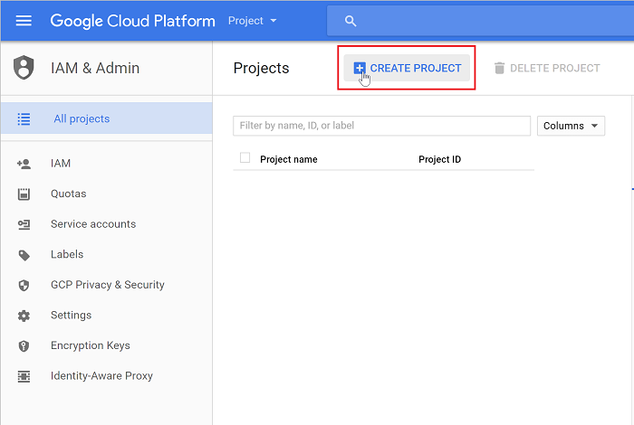
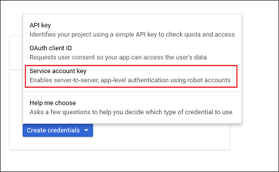
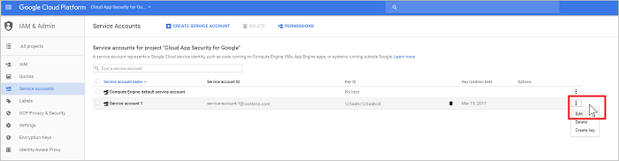

# Conectar o G Suite ao Microsoft Cloud App Security

*Aplica-se a: Microsoft Cloud App Security*

Este artigo fornece instruções para conectar o Microsoft Cloud App Security à sua conta existente do G Suite usando as APIs do conector. Essa conexão fornece visibilidade e controle sobre o uso do G Suite. 
    
## Configurar G Suite  
  
1. Como um Superadministrador do G Suite, entre em <a href="https://cloud.google.com/console/project" target="_blank">https://cloud.google.com/console/project</a>.  
  
2. Clique em **Criar projeto** para iniciar um novo projeto.  
  
      
  
3. Na tela **Novo projeto**, nomeie o projeto da seguinte maneira: 
   **Cloud App Security** e clique em **criar**.  
            
  
4. Depois que o projeto for criado, na barra de ferramentas, clique em **Google Cloud Platform**. Verifique se o projeto certo foi selecionado no menu suspenso na parte superior.
       
        

5. Sob **APIs**, clique em **ir para visão geral da API**.  
  
       
   
6. Clique em **Biblioteca** e habilite as seguintes APIs (use a linha de pesquisa se a API não aparecer na lista **APIs Populares**):  

   -   Admin SDK (SDK de Administração)  
  
   -   Audit API (API de Auditoria)
  
   -   API do Google Drive
  
   -   SDK do Marketplace do G Suite

     
  
   > [!NOTE]  
   >  Ignore o aviso **Credentials (Credenciais)** por enquanto.  

7. Clique em Habilitar para cada API.
       
8. Habilite as seguintes APIs:
  
       
  
9. Clique em **Credenciais** e, em seguida, selecione a guia **Tela de consentimento do OAuth**.
  
    - Em **Product name shown to users (Nome do produto mostrado aos usuários)** , digite **Microsoft Cloud App Security**.  
  
    - Todos os outros campos são opcionais.  
  
    - Clique em **Salvar**.  
  
        
  
10. Na guia **Credenciais**, clique na seta ao lado de **Criar credenciais**.  
  
       

11. Selecione **Chave de conta de serviço**.

       
  
12. Em **Criar chave de conta de serviço**, selecione **Nova conta de serviço** e digite qualquer nome, por exemplo **Conta de serviço 1**. Em **Função**, escolha **Projeto** e, depois, **Editor**. Em **Tipo de chave**, escolha **P12** e clique em **Criar**. Um arquivo de certificado P12 é salvo em seu computador.
 
       
  
13. Copie a **ID da conta de serviço** atribuída ao seu serviço, você precisará dela mais tarde.
        
14. Na tela **Credentials (Credenciais)** , clique em **Manage service accounts (Gerenciar contas de serviço)** na extrema direita.  
     
      
  
15. Clique nos três pontos à direita da conta de serviço que você criou e selecione **Editar**.  
  
       
  
16. Clique em **ID do cliente do modo de exibição domínio DELEGAÇÃO ampla**.
  
      

    -   Cópia de **ID do cliente** -você precisará dele mais tarde.

    -   Vá para [admin.google.com](https://admin.google.com/) e, em seguida, escolha **Segurança**.

    -   Selecione **Mostrar mais** e, em seguida, escolha **configurações avançadas**.

    -   No **autenticação** seção, selecione **acesso para cliente API gerenciar**.

    -   No **nome do cliente** , digite o **ID do cliente** que você copiou anteriormente.

          

    -   No **um ou mais escopos de API** , digite a seguinte lista de escopos necessários (copiar o texto e cole-o na caixa):

        `https://www.googleapis.com/auth/admin.reports.audit.readonly,https://www.googleapis.com/auth/admin.reports.usage.readonly,https://www.googleapis.com/auth/drive,https://www.googleapis.com/auth/drive.appdata,https://www.googleapis.com/auth/drive.apps.readonly,https://www.googleapis.com/auth/drive.file,https://www.googleapis.com/auth/drive.metadata.readonly,https://www.googleapis.com/auth/drive.readonly,https://www.googleapis.com/auth/drive.scripts,https://www.googleapis.com/auth/admin.directory.user.readonly,https://www.googleapis.com/auth/admin.directory.user.security,https://www.googleapis.com/auth/admin.directory.user.alias,https://www.googleapis.com/auth/admin.directory.orgunit,https://www.googleapis.com/auth/admin.directory.notifications,https://www.googleapis.com/auth/admin.directory.group.member,https://www.googleapis.com/auth/admin.directory.group,https://www.googleapis.com/auth/admin.directory.device.mobile.action,https://www.googleapis.com/auth/admin.directory.device.mobile,https://www.googleapis.com/auth/admin.directory.user`

    -    Clique em **autorizar**.

17. Abra o menu do Google clicando nas três linhas horizontais ao lado de Google Cloud Platform na barra de título. Clique em **Google Cloud Platform** e, em seguida, clique na guia **APIs e serviços** no menu à esquerda.  

18. No painel que abre, role para baixo até a lista de APIs habilitadas e clique na **API do Google Drive**.
         

19. Clique na **Integração de interface do usuário da unidade** e preencha as informações a seguir:

    - **Nome do Aplicativo**: Microsoft Cloud App Security.  
  
    - **Descrição Curta e Descrição Longa** (opcional): O Microsoft Cloud App Security fornece visibilidade dos aplicativos na nuvem, ajudando você a controlar, investigar e administrar o uso do aplicativo na nuvem, proteger dados corporativos e detectar atividades suspeitas de qualquer aplicativo na nuvem.  
  
    - O Google exige que você carregue pelo menos um ícone do aplicativo. Acesse [https://go.microsoft.com/fwlink/?linkid=862826](https://go.microsoft.com/fwlink/?linkid=862826) para baixar um arquivo zip que contém os ícones do Cloud App Security. Em seguida, no **ícone do aplicativo**, clique em **Selecionar** ao lado da imagem 128x128 e arraste-a para a tela pop-up. Clique em **Selecionar** ao lado da imagem 32x32 e arraste-a para a tela pop-up.  
  
    - Role para baixo na seção **Integração de unidade**, digite a seguinte URL em **Abrir URL:**  
  
       https://portal.cloudappsecurity.com/#/services/11770?tab=files  
    
        

20. Clique em **Salvar alterações**.

21. Volte para a lista **APIs habilitadas**. Clique no **SDK do Marketplace do G Suite**. 
      
22. Selecione a guia **Configuração**. 
  
    -   Copie o **Número do projeto (ID do Aplicativo)** que aparece na parte superior para usar mais tarde.  
  
    -   No **Nome do Aplicativo** digite o **Microsoft Cloud App Security**.
  
         Na **Descrição do aplicativo** digite "O Microsoft Cloud App Security fornece visibilidade dos aplicativos de nuvem, ajudando a controlar, investigar e administrar o uso do aplicativo de nuvem, proteger dados corporativos e detectar atividades suspeitas para qualquer aplicativo de nuvem”. 
    - Verifique se você clicou em **Concluído** na janela **Novo item**.      
     
         

    -   Desmarque a caixa de seleção **Enable individual install (Habilitar instalação individual)** .  
  
    -   Configure as quatro imagens necessárias em **Application icons (Ícones de aplicativo)** .  
  
         As imagens podem ser encontradas em: [https://go.microsoft.com/fwlink/?linkid=862826](https://go.microsoft.com/fwlink/?linkid=862826)  
  
    -   Preencha as seguintes **Support URLs (URLs de suporte)** :  
  
        -   **URL dos Termos de serviço**: https://go.microsoft.com/fwlink/?LinkID=733268  
  
        -   **URL da Política de privacidade**: https://go.microsoft.com/fwlink/?LinkId=512132  
  
    -   Em **Escopos do OAuth 2.0**, copie e cole as seguintes URLs (copie-as uma por uma e pressione Enter após cada uma):  
  
           https://www.googleapis.com/auth/admin.reports.audit.readonly  
  
           https://www.googleapis.com/auth/admin.reports.usage.readonly  
  
           https://www.googleapis.com/auth/drive  
  
           https://www.googleapis.com/auth/drive.appdata  
  
           https://www.googleapis.com/auth/drive.apps.readonly  
  
           https://www.googleapis.com/auth/drive.file  
  
           https://www.googleapis.com/auth/drive.metadata.readonly  
  
           https://www.googleapis.com/auth/drive.readonly  
  
           https://www.googleapis.com/auth/drive.scripts  
  
           https://www.googleapis.com/auth/admin.directory.user.readonly  
  
           https://www.googleapis.com/auth/admin.directory.user.security  
  
           https://www.googleapis.com/auth/admin.directory.user.alias  
  
           https://www.googleapis.com/auth/admin.directory.orgunit  
  
           https://www.googleapis.com/auth/admin.directory.notifications  
  
           https://www.googleapis.com/auth/admin.directory.group.member  
  
           https://www.googleapis.com/auth/admin.directory.group  
  
           https://www.googleapis.com/auth/admin.directory.device.mobile.action  
  
           https://www.googleapis.com/auth/admin.directory.device.mobile  
  
           https://www.googleapis.com/auth/admin.directory.user  

    -   Em **Visibilidade**, selecione **Meu domínio** (não público). 
    -   Clique em **Save Changes (Salvar Alterações)** .  
          
23. Vá para [admin.google.com](https://admin.google.com/) e, em seguida, escolha **Segurança**.
   
        
 
24. Selecione **API reference (Referência da API)** .  
         
      
25. Selecione **Enable API Access (Habilitar acesso à API)** e clique em **Save changes (Salvar alterações)** .  
  
      

  
## Configurar o Microsoft Cloud App Security  
  
1.  No portal do Cloud App Security, clique em **Investigar** e em **Aplicativos conectados**.  
  
2.  Na página **Aplicativos conectados**, clique no sinal de mais e selecione **G Suite**.  
       
  
3.  No pop-up, preencha as seguintes informações:  
  
       
  
    1.  **ID da conta de serviço** copiada na etapa 13.  
  
    2.  **Número do projeto (ID do aplicativo)** que você copiou na etapa 22.  
  
    3.  Carregue o **Certificado** P12 que você salvou na etapa 12. Você precisa da senha salva para fazer isso.  
  
    4.  Insira um **email da conta do administrador** do seu administrador do G Suite.  
  
    5.  Se você tiver uma conta do G Suite Business ou Enterprise, marque essa caixa de seleção. Para saber mais sobre quais recursos estão disponíveis no Cloud App Security para o G Suite Business ou Enterprise, confira [Habilitar ações de visibilidade, proteção e governança instantâneas para seus aplicativos](enable-instant-visibility-protection-and-governance-actions-for-your-apps.md).  
  
    6.  Clique em **Salvar configurações**.  
  
    7.  **Siga o link** para se conectar ao G Suite. Isso abre o G Suite e você deverá autorizar o acesso para o Cloud App Security.  
         
    8.  Certifique-se de que a conexão foi bem-sucedida clicando em **Testar agora**.  
  
         O teste pode levar alguns minutos.  
  
         Depois de receber uma notificação de êxito, clique em **Concluído** e feche a página do G Suite.  
  
  
Depois de conectar o G Suite, você receberá eventos por 60 dias antes da conexão.
  
Após conectar o G Suite, o Cloud App Security realiza uma verificação completa. Dependendo de quantos arquivos e usuários você tiver, a verificação completa poderá levar algum tempo. Para habilitar a verificação quase em tempo real, os arquivos nos quais a atividade é detectada são movidos para o início da fila de verificação. Por exemplo, um arquivo editado, atualizado ou compartilhado é verificado imediatamente. Isso não é aplicável a arquivos que não são modificados por natureza. Por exemplo, os arquivos que são exibidos, visualizados, impressos ou exportados são verificados durante a verificação regular.
  
  
## Próximas etapas 
[Controlar aplicativos de nuvem com políticas](control-cloud-apps-with-policies.md)   

[Os clientes Premier também podem criar uma nova solicitação de suporte diretamente no Portal Premier.](https://premier.microsoft.com/)  
  
  
