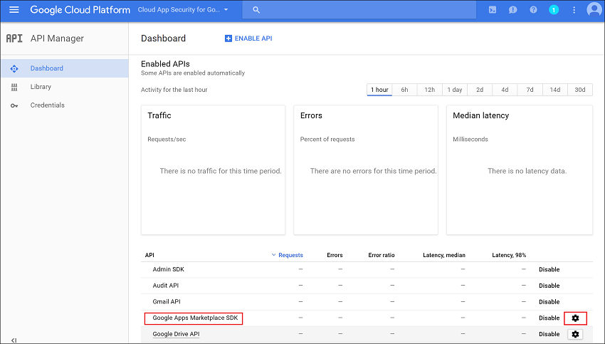

# Conectar o Google Apps ao Microsoft Cloud App Security
Esta seção fornece instruções para conectar o Cloud App Security à sua conta do Google Apps existente usando as APIs do conector.

  
  
## Configurar o Google Apps  
  
1.  Como um Superadministrador do Google Apps, faça logon em [https://cloud.google.com/console/project](https://cloud.google.com/console/project).  
  
2.  Clique em **Create an empty project (Criar um projeto vazio)** para iniciar um novo projeto.  
  
       
  
3.  Na tela **New project (Novo projeto)**:  
  
    1.  Nomeie o projeto como **Cloud App Security para Google**.  
  
    2.  Selecione se deseja ou não assinar as atualizações.  
  
    3.  Examine e aprove os termos de serviço.  
  
    4.  Clique em **Criar**.  
  
           
  
4.  Depois que o projeto for criado, clique em **Enable and manage APIs (Habilitar e gerenciar APIs)**.  
  
       
  
5.  Clique na guia **Enabled APIs (APIs Habilitadas)** e desabilitar todas as APIs listadas.  
  
       
  
6.  Clique na guia **APIs do Google** e habilite as seguintes APIs (use a linha de pesquisa se a API não aparecer na lista **APIs Populares**):  
  
       
  
    > [!NOTE]  
    >  Ignore o aviso **Credentials (Credenciais)** por enquanto.  
  
    -   Admin SDK (SDK de Administração)  
  
    -   Audit API (API de Auditoria)  
  
    -   Drive API (Unidade de API)  
  
    -   Google Apps Marketplace SDK (SDK do Google Apps Marketplace)  
  
    -   Gmail API (API do Gmail)  
  
           
  
7.  Você deve ter cinco **Enabled APIs (APIs Habilitadas)**:  
  
       
  
8.  Clique em **Credentials (Credenciais)** seguido de **OAuth consent (Consentimento OAuth)**  
  
    -   Em **Product name shown to users (Nome do produto mostrado aos usuários)**, digite **Cloud App Security para Google**.  
  
    -   Todos os outros campos são opcionais.  
  
    -   Clique em **Salvar**.  
  
       
  
9. Na guia **Credentials (Credenciais)**, clique na seta ao lado de **Create credentials (Criar credenciais)** e selecione **Service account key (Chave da conta de serviço)**.  
  
       
  
10. Em **Service account (Conta de serviço)**, selecione **New service account (Nova conta de serviço)** e digite qualquer nome, por exemplo **Conta de serviço 1**.  
  
       
  
     Em **Key type (Tipo de chave)**, escolha **P12** e clique em **Create (Criar)**.  
  
     Um arquivo de certificado P12 será baixado. Salve o certificado para uso posterior.  
  
       
  
11. Na guia **Credentials (Credenciais)**, clique em **Manage service accounts (Gerenciar contas de serviço)** na extrema direita.  
  
       
  
12. Clique nos três pontos à direita da conta de serviço que você criou e selecione **Edit (Editar)**.  
  
       
  
13. Marque a caixa de seleção **Habilitar a delegação em todo o domínio do Google Apps** e clique em **Salvar**.  
  
       
  
14. Copie o **Endereço de Email** atribuído ao seu serviço, você precisará dele mais tarde.  
  
       
  
15. Abra o menu do Google clicando as três linhas horizontais ao lado de Google Cloud Platform e selecione **API manager (Gerenciador de API)**.  
  
       
  
     Selecione **Enabled APIs (APIs Habilitadas)**.  
  
       
  
16. Clique na engrenagem de configurações ao lado de **Drive API (Unidade de API)** e em **Drive UI Integration (Integração de Interface do Usuário da Unidade)**, preencha o seguinte:  
  
    -   **Application Name (Nome do Aplicativo)**: Cloud App Security para Google.  
  
    -   **Short Description & Long Description (Descrição curta e descrição longa)**: o Microsoft Cloud App Security permite a visibilidade dos aplicativos de nuvem, ajudando a controlar, investigar e administrar o uso do aplicativo de nuvem, proteger dados corporativos e detectar atividades suspeitas para qualquer aplicativo de nuvem.  
  
    -   Em **Application icon (Ícone do aplicativo)**, carregue as imagens de 128 x 128 e 32 x 32.  
  
         As imagens podem ser encontradas em: [https://portal.cloudappsecurity.com/cas/static/files/MSLogos.zip](https://portal.cloudappsecurity.com/cas/static/files/MSLogos.zip)  
  
    -   Digite o seguinte em **Open URL: (Abrir URL:)**  
  
         https://portal.cloudappsecurity.com/#/services/11770?tab=files  
  
    -   Clique em **Save Changes (Salvar Alterações)**.  
  
           
  
17. Na lista **Enabled APIs (APIs Habilitadas)**, clique na engrenagem de configuração ao lado de **Google Apps Marketplace SDK (SDK do Google Apps Marketplace)** e selecione a guia **Configuration (Configuração)**.  
  
    -   Copie o **Número do projeto (ID do Aplicativo)** que aparece na parte superior para usar mais tarde.  
  
    -   **Application Name (Nome do Aplicativo)**: Cloud App Security para Google.  
  
         Preencha o campo **Application description (Descrição do aplicativo)** com “O Microsoft Cloud App Security fornece visibilidade dos aplicativos de nuvem, ajudando a controlar, investigar e administrar o uso do aplicativo de nuvem, proteger dados corporativos e detectar atividades suspeitas para qualquer aplicativo de nuvem”.  
  
    -   Desmarque a caixa de seleção **Enable individual install (Habilitar instalação individual)**.  
  
    -   Configurar as quatro imagens necessárias em **Application icons (Ícones de aplicativo)**.  
  
         As imagens podem ser encontradas em: [https://portal.cloudappsecurity.com/cas/static/files/MSLogos.zip](https://portal.cloudappsecurity.com/cas/static/files/MSLogos.zip)  
  
           
  
    -   Preencha as seguintes **Support URLs (URLs de suporte)**:  
  
        -   **URL dos Termos de Serviço**: http://go.microsoft.com/fwlink/?LinkID=733268  
  
        -   **URL da Política de Privacidade**: http://go.microsoft.com/fwlink/?LinkId=512132  
  
    -   Em **Escopos do OAuth 2.0**, digite o seguinte (um por linha. Pressione Enter para confirmar):  
  
        -   https://www.googleapis.com/auth/admin.reports.audit.readonly  
  
        -   https://www.googleapis.com/auth/admin.reports.usage.readonly  
  
        -   https://www.googleapis.com/auth/drive  
  
        -   https://www.googleapis.com/auth/drive.appdata  
  
        -   https://www.googleapis.com/auth/drive.apps.readonly  
  
        -   https://www.googleapis.com/auth/drive.file  
  
        -   https://www.googleapis.com/auth/drive.metadata.readonly  
  
        -   https://www.googleapis.com/auth/drive.readonly  
  
        -   https://www.googleapis.com/auth/drive.scripts  
  
        -   https://www.googleapis.com/auth/admin.directory.user.readonly  
  
        -   https://www.googleapis.com/auth/admin.directory.user.security  
  
        -   https://www.googleapis.com/auth/admin.directory.user.alias  
  
        -   https://www.googleapis.com/auth/admin.directory.orgunit  
  
        -   https://www.googleapis.com/auth/admin.directory.notifications  
  
        -   https://www.googleapis.com/auth/admin.directory.group.member  
  
        -   https://www.googleapis.com/auth/admin.directory.group  
  
        -   https://www.googleapis.com/auth/admin.directory.device.mobile.action  
  
        -   https://www.googleapis.com/auth/admin.directory.device.mobile  
  
        -   https://www.googleapis.com/auth/admin.directory.user  
  
    -   Clique em **Save Changes (Salvar Alterações)**.  
  
18. Selecione **Security (Segurança)** na lista de controles. Se você não encontrar essa opção listada, selecione More controls (Mais controles) na barra cinza na parte inferior da página e selecione **Security (Segurança)**.  
  
       
  
19. Selecione **API reference (Referência da API)**.  
  
       
  
20. Selecione **Enable API Access (Habilitar acesso à API)** e clique em **Save changes (Salvar alterações)**.  
  
       
  
## Configurar o Microsoft Cloud App Security  
  
1.  No portal do Cloud App Security, clique em **Investigar** e em **Aplicativos conectados**.  
  
2.  Na página **Aplicativos conectados**, clique no sinal de mais e selecione **Google Apps**.  
  
       
  
3.  Na janela pop-up, preencha o seguinte:  
  
       
  
    1.  **Google Service Account email address (Endereço de email da conta de serviço do Google)** que você copiou na etapa 14.  
  
    2.  **Número do Projeto do Google (ID do Aplicativo)** que você copiou na etapa 17.  
  
    3.  Carregue o **Google Certificate (Certificado do Google)** P12 que você salvou na etapa 10.  
  
    4.  Insira um **email do administrador** do seu administrador do Google Apps.  
  
    5.  Se você tiver uma conta do Google Apps Unlimited, marque essa caixa de seleção. Para obter informações sobre quais recursos estão disponíveis no Cloud App Security para o Google Apps ilimitado, consulte [Habilitar ações de visibilidade, proteção e governança instantâneas para seus aplicativos](enable-instant-visibility-protection-and-governance-actions-for-your-apps.md).  
  
    6.  Clique em **Salvar configurações**.  
  
    7.  Utilize **Seguir o link** para se conectar ao Google Apps. Isso abrirá o Google Apps e será solicitado que você autorize o acesso ao Cloud App Security.  
  
           
  
    8.  Certifique-se de que a conexão foi bem-sucedida clicando em **Testar API**.  
  
         O teste pode levar alguns minutos.  
  
         Depois de receber uma notificação de êxito, clique em **Concluído** e feche a página do Google Apps.  
  
  
Depois de conectar o Google Apps, você receberá eventos por 60 dias antes da conexão.
  
Após conectar o Google Apps, o Cloud App Security realizará uma verificação completa. Dependendo de quantos arquivos e usuários você tiver, a verificação completa poderá levar algum tempo. Para habilitar a verificação quase em tempo real, os arquivos nos quais atividades são detectadas movidos para o início da fila de verificação, como por exemplo um arquivo que é editado, atualizado ou compartilhado é examinado imediatamente e não aguarda até ser alcançado pelo processo de verificação regular. Isso não se aplica a arquivos que não são inerentemente modificados, como arquivos que são exibidos, visualizados, impressos ou exportados.
  
  
## Veja também  
[Controlar aplicativos de nuvem com políticas](control-cloud-apps-with-policies.md)   
[Para obter suporte técnico, visite a página de suporte assistido do Cloud App Security.](http://support.microsoft.com/oas/default.aspx?prid=16031)   
[Os clientes Premier também podem escolher o Cloud App Security diretamente no Portal Premier.](https://premier.microsoft.com/)  
  
  

<!--HONumber=Nov16_HO5-->

