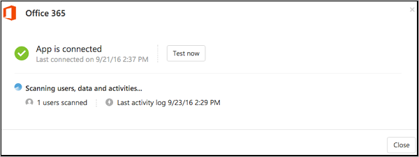

# Conectar o Office 365 ao Microsoft Cloud App Security
Esta seção fornece instruções para conectar o Cloud App Security à sua conta do Microsoft Office 365 existente usando a API do conector de aplicativos.  
  
  

## Como conectar o Office 365 ao Cloud App Security  
  
> [!NOTE]
>- Você deve ter pelo menos uma licença do Office 365 atribuída para conectar o Office 365 ao Cloud App Security.
>-  O log de auditoria de administrador do Exchange, que é habilitado por padrão no Office 365, registra um evento no log de auditoria do Office 365 quando um administrador (ou um usuário que tenha recebido privilégios administrativos) faz uma alteração em sua organização do Exchange Online. As alterações feitas usando o centro de administração do Exchange ou executando um cmdlet do Windows PowerShell são registradas no log de auditoria de administrador do Exchange. Para ver informações detalhadas sobre o log de auditoria de administrador do Exchange, consulte [Log de auditoria de administrador](http://go.microsoft.com/fwlink/p/?LinkID=619225).
>- O log de auditoria do Exchange Mailbox deve estar ativado para cada caixa de correio do usuário para que as atividades do usuário no Exchange Online sejam registrada em log; consulte [Atividades do Exchange Mailbox](https://support.office.com/article/Search-the-audit-log-in-the-Office-365-Security-Compliance-Center-0d4d0f35-390b-4518-800e-0c7ec95e946c).
>- Se os aplicativos do Office estiverem habilitados, os grupos que fazem parte do Office 365 também são criados nos aplicativos do Office; se o SharePoint estiver habilitado, por exemplo, os grupos do Office 365 serão criados nele.
 
1.  Na página **Aplicativos conectados**, clique no botão de mais e selecione **Office 365**.  

2.  No pop-up do Office 365, clique em Conectar o Office 365.

       
 
3.  Clique em “Testar agora” para testar a conexão para o Office 365. O teste pode levar alguns minutos.
  
     
 
4.   Depois de ser indicado que a conexão do Office 365 foi concluída com êxito, clique em **Fechar**.
  
      

> [!NOTE] 
> Depois de conectar o Office 365, você verá os dados de uma semana atrás, incluindo quaisquer aplicativos de terceiros conectados ao Office 365 que recebem APIs. Para aplicativos de terceiros que não recebiam APIs antes da conexão, você verá os eventos a partir do momento que conectar o Office 365, pois o Cloud App Security ativa todas as APIs desativadas por padrão.

## Veja também  
[Controlar aplicativos de nuvem com políticas](control-cloud-apps-with-policies.md)   
[Para obter suporte técnico, visite a página de suporte assistido do Cloud App Security.](http://support.microsoft.com/oas/default.aspx?prid=16031)   
[Os clientes Premier também podem escolher o Cloud App Security diretamente no Portal Premier.](https://premier.microsoft.com/)  
  
  

<!--HONumber=Nov16_HO5-->

