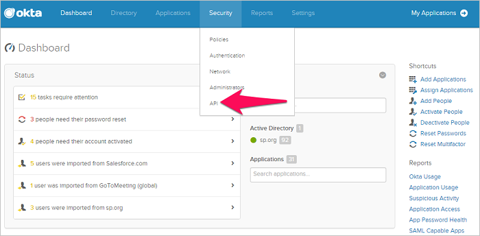

# Conectar o Okta ao Microsoft Cloud App Security

*Aplica-se a: Microsoft Cloud App Security*

Este artigo fornece instruções para conectar o Microsoft Cloud App Security à sua conta existente do Okta usando as APIs do conector. Essa conexão fornece visibilidade e controle sobre o uso do Okta.
  
  
## Como conectar o Okta ao Cloud App Security  
  
1.  É recomendável que você crie uma Conta de Serviço de administrador no Okta para o Cloud App Security.  
  
     Certifique-se de usar uma conta com permissões de Superadministrador.  
  
     Verifique se sua conta do Okta é verificada.  
  
2.  No console do Okta, clique em **Administração**.  
  
    -   Clique em **Segurança** e em **API**.  
  
           
  
    -   Clique em **Create Token (Criar Token)**.  
  
           
  
    -   No pop-up **Criar Token**, dê um nome ao token do Cloud App Security e clique em **Criar Token**.  
  
           
  
    -   No pop-up **Token created successfully (Token criado com êxito)**, copie o **Token value (Valor do token)**.  
  
           
  
3.  No console do Cloud App Security, clique em **Investigar** e em **Aplicativos conectados**.  
  
4.  Na **página Conectores de aplicativos**, clique no botão de mais e depois em **Okta**.  
  
       
  
5.  No pop-up que abrir, no campo **Domain (Domínio)**, insira seu domínio do Okta e cole seu token no campo **Token**.  
  
6.  Clique em **Conectar** para criar o token para o Okta no Cloud App Security.  
  
7.  Certifique-se de que a conexão foi bem-sucedida clicando em **Testar API**.  
  
     O teste pode levar alguns minutos. Depois de receber uma notificação de êxito, clique em **Fechar**.  
  
Depois de conectar o Okta, você receberá eventos por 60 dias antes da conexão.
  
## Próximas etapas  
[Controlar aplicativos de nuvem com políticas](control-cloud-apps-with-policies.md)   

[Os clientes Premier também podem criar uma nova solicitação de suporte diretamente no Portal Premier.](https://premier.microsoft.com/)  
  
