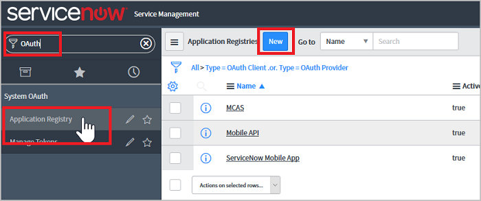
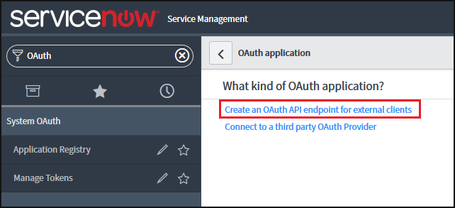
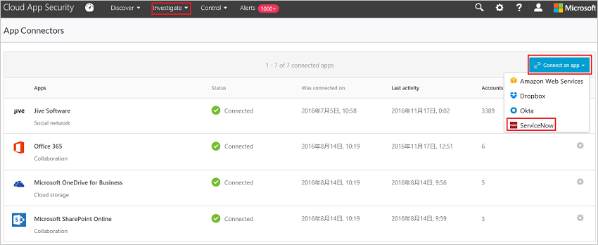
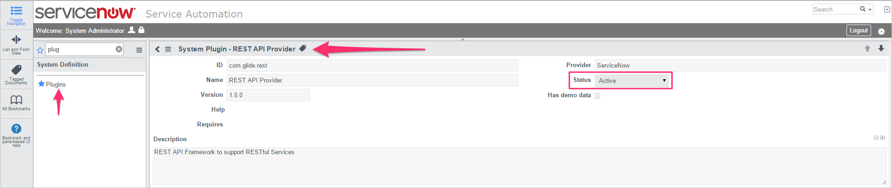

# Conectar o ServiceNow ao Microsoft Cloud App Security

*Aplica-se ao: Microsoft Cloud App Security*

Este artigo fornece instruções para conectar o Microsoft Cloud App Security à sua conta existente do ServiceNow usando a API do conector de aplicativos. 

> [!NOTE]
>  É recomendável implantar o ServiceNow usando os tokens de aplicativo OAuth, disponíveis para Fuji e versões posteriores (consulte a [documentação do ServiceNow](http://wiki.servicenow.com/index.php?title=OAuth_Applications#gsc.tab=0) relevante). Para as versões anteriores, um [modo de conexão herdado](#legacy-servicenow-connection) está disponível com base no usuário/senha. O nome de usuário/senha fornecidos são usados apenas para geração de token de API e não são salvos após o processo de conexão inicial.
> 
> [!NOTE]
>  O Cloud App Security é compatível com versões do ServiceNow do Eureka, Fiji, Geneva, Helsinque e Istanbul. Para conectar o ServiceNow ao Cloud App Security, você deve ter a função **Admin** e verificar se a instância do ServiceNow dá suporte ao acesso à API.  Para obter mais informações, consulte a [Documentação do produto ServiceNow](http://wiki.servicenow.com/index.php?title=Base_System_Roles#gsc.tab=0).
  
## Como conectar o ServiceNow ao Cloud App Security usando OAuth
  
  
1. Entre com uma conta do administrador em sua conta do ServiceNow.  
 
   > [!NOTE]
   >  O nome de usuário/senha fornecidos são usados apenas para geração de token de API e não são salvos após o processo de conexão inicial.

2. Na barra de pesquisa do **Navegador de filtro**, digite **OAuth** e selecione **Registro do Aplicativo**.

3. Na barra de menus **Registros de Aplicativo**, clique em **Novo** para criar um novo perfil de OAuth.

   

4. Em **Que tipo de aplicativo OAuth?**, clique em **Criar um ponto de extremidade de API do OAuth para clientes externos**.

   

5. Em **Novos registros de aplicativo**, preencha os seguintes campos:
    
    - Campo **Nome**, nomeie o novo perfil do OAuth, por exemplo, CloudAppSecurity. 
    
    - A **ID do Cliente** é gerada automaticamente. Copie essa ID, você precisará colá-la no Cloud App Security para concluir a conexão.
    
    - No campo **Segredo do Cliente**, insira uma cadeia de caracteres. Se deixado vazio, um segredo aleatório é gerado automaticamente. Copie e salve-o para mais tarde. 
    
    - Aumente a **Vida do token de acesso** para pelo menos 3.600.
    
    - Clique em **Enviar**.

   

6. No portal do Cloud App Security, clique em **Investigar** e em **Aplicativos conectados**.  
  
7. Na página **Conectores de aplicativos**, clique no botão de mais e depois em **ServiceNow**.  
  
      
  
8. No pop-up, adicione a ID de usuário do ServiceNow, a senha, a URL da instância, a ID do Cliente e o Segredo do Cliente do ServiceNow nas caixas apropriadas. Para localizar sua ID de usuário do ServiceNow, no portal do ServiceNow, acesse **Usuários** e, em seguida, localize seu nome na tabela.

   
  
9. Clique em **Conectar**.  
  
      
  
10. Certifique-se de que a conexão foi bem-sucedida clicando em **Testar agora**.  
  
    O teste pode levar alguns minutos. Depois de receber uma notificação de êxito, clique em **Fechar**.  
  
Depois de conectar o ServiceNow, você receberá eventos por 60 dias antes da conexão.
  
## Conexão herdada do ServiceNow

Para conectar o ServiceNow ao Cloud App Security, é necessário ter permissões do nível de administrador e verificar se a instância do ServiceNow dá suporte ao acesso à API.   

1. Entre com uma conta do administrador em sua conta do ServiceNow.   

2. Crie uma nova conta de serviço para o Cloud App Security e anexe a função de administrador à conta recém-criada.   

3. Verifique se o plug-in da API REST está ativado.   

      

4. No portal do Cloud App Security, clique em **Investigar** e em **Aplicativos sancionados**.   

5. Na linha ServiceNow, clique em **Conectar** na coluna **Status do Conector de Aplicativos** ou clique no botão **Conectar um aplicativo** e em **ServiceNow**.   

      

6. Na página de configurações do ServiceNow, na guia API, adicione sua ID de usuário do ServiceNow, senha e URL da instância do ServiceNow nas caixas apropriadas.   

7. Clique em **Conectar**.   

      

8. Certifique-se de que a conexão foi bem-sucedida clicando em **Testar API**.   
  
   O teste pode levar alguns minutos. Depois de receber uma notificação de êxito, clique em **Fechar**.    
   Depois de conectar o ServiceNow, você receberá eventos por 60 dias antes da conexão. 

## Próximas etapas 
[Controlar aplicativos de nuvem com políticas](control-cloud-apps-with-policies.md)   

[Os clientes Premier também podem escolher o Cloud App Security diretamente no Portal Premier.](https://premier.microsoft.com/)  
  
