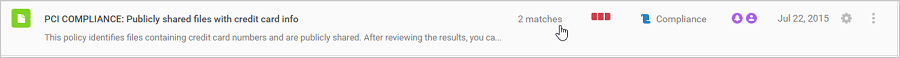
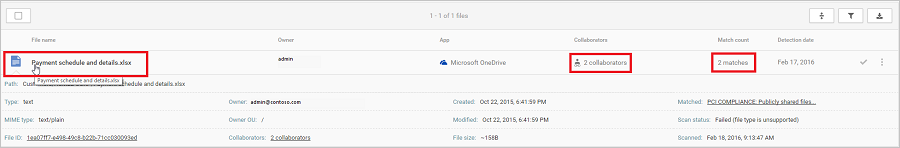

# Control

*Aplica-se ao: Microsoft Cloud App Security*

Você pode aplicar ações de governança aos arquivos de usuários em seu ambiente de nuvem. Depois investigar completamente e aprender sobre sua nuvem, será possível usar ações de governança para ajudar a proteger sua organização.  

## Usar políticas para avaliar os riscos  
Depois que você examinar os alertas abertos, vá para o Centro de políticas para examinar as violações de política que não dispararam alertas.  

-   No painel do Cloud App Security, clique em **Controle** e em **Políticas**.  

-   Selecione uma política específica para ver a lista **Correspondência agora** das correspondências de política que não dispararam alertas.  

-   Clique nas violações, uma de cada vez, e decida o que fazer para cada uma. Para obter mais informações sobre as ações de governança, consulte as figuras a seguir.  

     Se a política estiver definida para encontrar violações de conformidade e alguém salvar os números de cartão de crédito em arquivos no OneDrive, você terá uma correspondência na política.  

       

-   Selecione a correspondência para ver os arquivos reais que violaram a política.  

       

     Você pode selecionar o próprio arquivo para obter informações sobre os arquivos.  

     Você pode clicar em **Colaboradores** para ver quem tem acesso a esse arquivo.  

     Você pode clicar nas **Correspondências** para ver os números de cartão de crédito reais.  

       

## Aplicar ações de governança  
Você pode aplicar ações de governança de dentro de políticas, de dentro de alertas e do log **Arquivos**.  

A qualquer momento, você pode examinar e ver o status de todas as ações de governança aplicadas anteriormente acessando a engrenagem **Configurações** e escolhendo **Log de governança**. 

Para qualquer ação de governança com falha, escolha o ícone **Tentar novamente** para aplicá-la outra vez.    

Dependendo do tipo de política, violação e aplicativo, diferentes ações de governança estão disponíveis.  

## Passar da detecção para a correção automática  
Depois de definir e personalizar seus filtros de política, você pode selecionar ações de governança automatizadas que serão executadas após cada violação da sua política.  
Uma vez que as ações de correção utilizam as APIs do provedor de nuvem, as ações podem variar de um aplicativo para outro.  

> [!NOTE]  
>  Tome muito cuidado ao definir ações de governança. Elas podem levar a perda irreversível de permissões de acesso a seus arquivos.  
> É uma boa ideia restringir os filtros para representar exatamente os arquivos nos quais você deseja agir, usando vários campos de pesquisa. Quanto mais restritos forem os filtros, melhor.  
>   
>  Para obter diretrizes, você pode usar o botão **Editar e visualizar resultados** na seção **Filtros**.  

  

## Migração  
O Cloud App Security ajuda a distribuir suas migrações, permitindo que você saiba quem na sua organização está usando quais aplicativos e fornecendo as ferramentas para monitorar a adoção de novos aplicativos. Ele também pode ajudar a descobrir quais tipos de aplicativos você deve oferecer na sua organização, fornecendo as ferramentas para ver o que todos já estão usando.  

### Migrar seus usuários para um novo aplicativo  
Considere este cenário: você adquiriu recentemente o Office 365 e deseja que todos os usuários em sua organização parem de usar todos os outros aplicativos de armazenamento em nuvem e comecem a usar o OneDrive. Aqui está o que você talvez queira fazer:  

1. Vá para seu **Painel do Cloud Discovery** e, em **Categorias de aplicativos**, filtre os aplicativos por **Armazenamento em Nuvem**. Classifique os resultados por **Usuários** ou **Endereços IP** e verifique qual aplicativo é mais popular.  

2. Você pode ver quais usuários estão usando outros aplicativos. Também é possível analisar detalhadamente esses aplicativos e notificar os usuários que você deseja que elas migrem para o OneDrive da seguinte maneira:

   1. No seu **Painel do Cloud Discovery**, clique em **Dropbox** e, em seguida, selecione a guia **Endereço IP** ou **Usuários**.  

   2. Escolha o ícone de seta **Exportar** e as opções de exportação. 

### Encontrar alternativas mais seguras  
O catálogo de serviços do Cloud App Security pode ajudá-lo a encontrar alternativas que funcionem para sua organização, em vez de aplicativos arriscados que seus usuários podem estar utilizando.  

Considere este cenário: você está pensando em comprar uma ferramenta de produtividade, mas não tem certeza se seus usuários a usariam.  

1.   Vá para o **Cloud Discovery Dashboard (Painel do Cloud Discovery)**.  

2.   Em **Categorias**, filtre aplicativos por **Produtividade**.  

3.   Para cada aplicativo em uso, confira a **Pontuação** para ver se é seguro e, se não for, por que não.  

4.   Se decidir que deseja comprar uma licença empresarial para toda a organização, pode ser útil também olhar a coluna **usuários**. Lá, é possível ver o que é mais popular entre os usuários, consultar se é confiável e conferir quais recursos de segurança existem antes de tomar a decisão.  

## Próximas etapas
Para saber como usar e configurar políticas para controlar o uso do aplicativo de nuvem, consulte [Controlar aplicativos de nuvem com políticas](control-cloud-apps-with-policies.md).   

[Os clientes Premier também podem criar uma nova solicitação de suporte diretamente no Portal Premier.](https://premier.microsoft.com/)  
