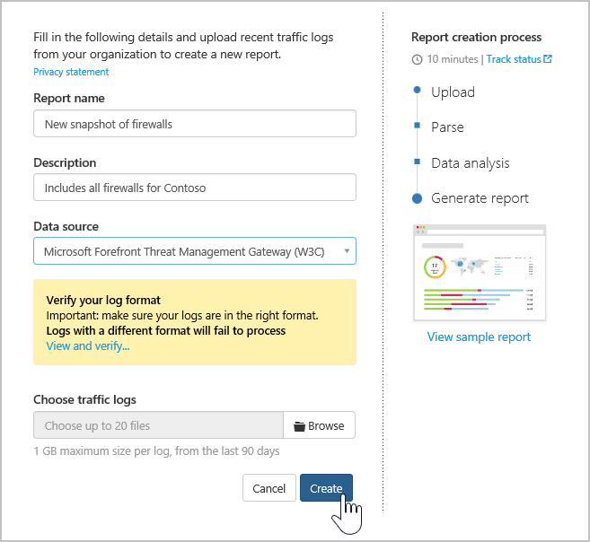
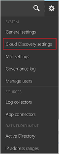

# Criar instantâneo de relatórios do Cloud Discovery
É importante carregar um log manualmente e permitir que o Cloud App Security analise-o antes de tentar usar o coletor de logs automático.
Se você ainda não tiver um log e desejar ver um exemplo da aparência do seu log, siga o procedimento abaixo e baixe um arquivo de log de exemplo para ver qual deve ser a aparência do seu log.

Para criar um relatório de instantâneo:
  
1.  Colete arquivos de log do firewall e do proxy por meio dos quais os usuários da sua organização acessam a Internet. Certifique-se de coletar logs durante os períodos de tráfego de pico que representam a atividade de todos os usuários na sua organização.  
  
2.  No portal do Cloud App Security, clique em **Descobrir** e **Criar novo relatório de instantâneo**.  
  
   
     
3.  Insira um **Nome do relatório** e uma **Descrição**
  
      

4.  Selecione a **Fonte de dados** da qual você deseja carregar os arquivos de log.  
  
5. Verifique o formato do seu log para certificar-se de que ele está formatado corretamente de acordo com o exemplo que pode ser baixado. Clique em **Exibir e Verificar** e, em seguida, clique em **Baixar Log de Exemplo**. Em seguida, compare seu log com o exemplo fornecido para verificar se ele é compatível. 

   

  > [!NOTE]
  > O formato de exemplo FTP tem suporte em instantâneos e no upload automatizado enquanto o syslog tem suporte somente no upload automatizado.  
Baixar um exemplo de log também baixará um exemplo de log FTP.

5.  **Escolha os logs de tráfego** que você deseja carregar. Você pode carregar até 20 arquivos ao mesmo tempo. Também há suporte para arquivos compactados.  
  
6.  Clique em **Criar**.  

7.  Após o upload ser concluído, a mensagem de status será exibida no canto superior direito da tela avisando que o log foi carregado com êxito.  
  
8.  Depois de carregar os arquivos de log, levará algum tempo para que eles possam ser analisados e examinados.  
Após o processamento dos arquivos de log ser concluído, você receberá um email para avisar que ele está pronto. 
  
9. Uma faixa de notificação aparecerá na barra de status na parte superior do portal para atualizar o status de processamento dos arquivos de log.  
 
   
10. Depois que os logs forem carregados com êxito, você deverá ver uma notificação informando que o processamento do arquivo de log foi concluído com êxito. Neste ponto, você pode exibir o relatório clicando no link na barra de status ou indo para a engrenagem de Configurações e selecionando **Configurações do Cloud Discovery**.   
  
     
11. Em seguia, selecione **Gerenciar relatórios de instantâneo** e seu relatório de instantâneo.
 

  
      
## Veja também  
[Controlar aplicativos de nuvem com políticas](control-cloud-apps-with-policies.md)   
[Para obter suporte técnico, visite a página de suporte assistido do Cloud App Security.](http://support.microsoft.com/oas/default.aspx?prid=16031)   
[Os clientes Premier também podem escolher o Cloud App Security diretamente no Portal Premier.](https://premier.microsoft.com/)  
    
      
  