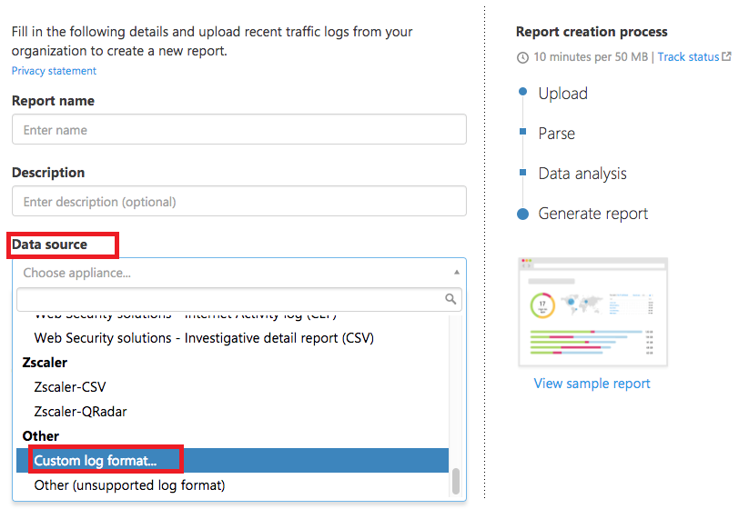
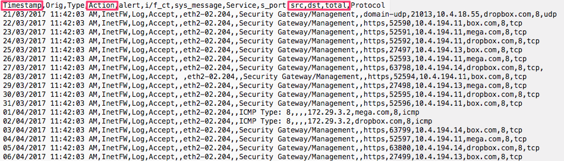

# Usar o analisador de log personalizado

*Aplica-se a: Microsoft Cloud App Security*

O Cloud App Security permite que você configure um analisador personalizado para corresponder e processar o formato de seus logs, de modo que eles possam ser usados para o Cloud Discovery. Normalmente, você usaria um analisador personalizado se o firewall ou o dispositivo não fosse explicitamente compatível com o Cloud App Security. Pode ser um analisador de CSV ou um analisador de valor de chave personalizado.

O analisador personalizado permite que você use os logs de firewalls sem suporte seguindo esse processo.

Para configurar um analisador personalizado:

1. No portal do Cloud App Security, clique em **Descobrir** e **Criar novo relatório de instantâneo**.

    

2. Insira um **nome de relatório** e uma **Descrição**

3. Em **Fonte de dados**, selecione **Formato de log personalizado... **.

    

4. Colete os logs do firewall e do proxy por meio dos quais os usuários da sua organização acessam a Internet. Certifique-se de coletar logs durante os períodos de tráfego de pico que representam a atividade de todos os usuários na sua organização.

5. Abra os logs que você deseja processar em um editor de texto. Examine o formato deles, certificando-se de que os nomes das colunas no log correspondam aos campos na tela **Formato de log personalizado**.

    

6. Em seguida, preencha os campos com base em seus dados para indicar quais colunas nos dados correspondem aos campos específicos no Cloud App Security. Será necessário modificar os nomes de coluna em seu arquivo de log para correlacionar corretamente.

    > [!NOTE]
    > Os campos diferenciam maiúsculas de minúsculas. Digite os nomes das colunas de forma idêntica no Cloud App Security e no arquivo de log. Além disso, certifique-se de que o formato de data escolhido seja idêntico.

    

7. Clique em **Salvar**. O formato de log personalizado configurado por você será salvo como o analisador personalizada padrão. Você pode editá-lo a qualquer momento clicando em **Editar**.

8. Em **Escolher os logs de tráfego**, selecione o arquivo de log que você modificou e carregue-o. Você pode carregar até 20 arquivos ao mesmo tempo. Também há suporte para arquivos compactados e zipados.

9. Clique em **Criar**.

10. Após o upload ser concluído, a mensagem de status será exibida no canto superior direito da tela avisando que o log foi carregado com êxito.

11. Depois de carregar os arquivos de log, levará algum tempo para que eles possam ser analisados e examinados.
    Após o processamento dos arquivos de log ser concluído, você receberá um email para avisar que ele está pronto.

12. Uma faixa de notificação será exibida na barra de status na parte superior do **painel do Cloud Discovery**. A faixa atualiza você sobre o status de processamento dos arquivos de log.
    

13. Depois que os logs forem carregados com êxito, você deverá ver uma notificação informando que o processamento do arquivo de log foi concluído com êxito. Neste ponto, é possível exibir o relatório clicando no link na barra de status ou indo para a engrenagem de Configurações e selecionando **Configurações do Cloud Discovery**.

    
14. Em seguia, selecione **Gerenciar relatórios de instantâneo** e seu relatório de instantâneo.

    

## Próximas etapas

> [!div class="nextstepaction"]
> [Criar instantâneo de relatórios do Cloud Discovery](create-snapshot-cloud-discovery-reports.md)

> [!div class="nextstepaction"]
> [Configurar upload de log automático para relatórios contínuos](configure-automatic-log-upload-for-continuous-reports.md)

> [!div class="nextstepaction"]
> [Trabalhando com dados do Cloud Discovery](working-with-cloud-discovery-data.md)

[!INCLUDE [Open support ticket](includes/support.md)]
