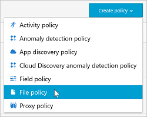
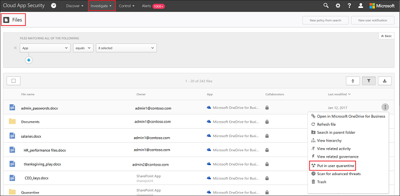

# Controlar e proteger seus arquivos  

No mundo corporativo atual, em que há tantos dados e tantos dispositivos, pode ser difícil manter o controle de onde seus dados estão e quem tem acesso a eles. O Cloud App Security permite que você assuma o controle sobre seus dados com a proteção de arquivos na nuvem. O Cloud App Security fornece ferramentas para a criação de políticas para o que você deseja ou não permitir em sua nuvem corporativa, e oferece uma ampla gama de processos automatizados para fornecer verificações de conformidade contínuas, tarefas de Descoberta Eletrônica jurídica, DLP para conteúdo confidencial armazenado na sua nuvem, ou compartilhado externamente ou publicamente, e muitos outros casos de uso.  
O Cloud App Security pode monitorar qualquer tipo de arquivo com base em mais de 20 filtros de metadados (como por exemplo, nível de acesso e tipo de arquivo). Para saber mais, veja [Arquivos](file-filters.md). Estes são dois exemplos de ameaças relacionadas a dados que todas as organizações enfrentam, com procedimentos para proteger seus arquivos na nuvem.
 
## Arquivos que contêm dados confidenciais estão sendo compartilhados externamente 

Esse caso de uso aplica-se ao Office 365, G Suite, Box, Dropbox e Salesforce.

### A AMEAÇA
Os funcionários estão compartilhando arquivos da empresa que contêm dados confidenciais com pessoas de fora da organização. Isso pode resultar em vazamentos de dados não monitorados. Isso pode ser inocente e não violar as políticas da empresa, mas mesmo nesse caso é importante monitorar o que está sendo compartilhado, para que você sempre esteja ciente de como a rede está sendo usada e quais dados estão sendo compartilhados externamente.

### A SOLUÇÃO
Obtenha visibilidade sobre o compartilhamento de arquivos em sua rede e implante as ações de governança aplicando as seguintes políticas e ações de governança no Cloud App Security.

#### Pré-requisitos

[Conectar](enable-instant-visibility-protection-and-governance-actions-for-your-apps.md) ao menos um aplicativo de nuvem ao Cloud App Security.

#### Configurar o monitoramento

1.    Controlar seus arquivos criando uma política

    1. Na página **Políticas**, clique em [**Criar política de arquivos**](data-protection-policies.md). 
    

    2. No campo [**Modelo de política**](policy-template-reference.md), escolha **Arquivo que contém PII detectado na nuvem (mecanismo de DLP interno)** e clique em **Aplicar modelo**. 
    
    3. Para monitorar o compartilhamento inadequado de arquivos que contêm informações confidenciais, adicione um filtro com o nível de acesso que você está tentando impedir. Por exemplo, **Nível de acesso igual a Externo, Público, Público (Internet)**. 
     

2. Investigar suas correspondências
    
    1. Na página **Políticas**, clique no nome da política para ir para **Relatório de Políticas** e analise as correspondências que foram criadas para a política.

    2. Você pode investigar a correspondência clicando em uma correspondência específica para abrir a gaveta de arquivos. Na gaveta, é possível ver as outras políticas que correspondem a este arquivo, o status de verificação do conteúdo e, se você clicar aqui, pode ver as correspondências do conteúdo. Você pode clicar em **Colaboradores** para ver a lista de colaboradores e se há rótulos de classificação no arquivo. Você também pode examinar o **Caminho** para ver onde o arquivo foi salvo e obter mais informações sobre o arquivo em si.
    
    3. Se você descobrir falsos positivos, marque-os com uma marca de verificação para excluí-los do relatório e das correspondências dinâmicas. Você pode usar o recurso de comentários para informar a equipe do Cloud App Security sobre as melhorias que gostaria de adicionar. 

#### Validar a política

1. Crie um novo documento do Word com o seguinte texto: 078-05-1120.
2. Em seguida, salve o arquivo como *arquivo de teste.docx* e compartilhe-o com alguém de fora de seu domínio ou com uma URL pública. 
3. Vá para o relatório de políticas. Uma correspondência de política do arquivo deve aparecer em breve. 
4. Você pode clicar na correspondência para ver o contexto do arquivo. A correspondência em si será mascarada para proteger os dados confidenciais. 

#### Remover o risco

Depois de validar e ajustar a política para garantir que esteja executando como pretendido, faça o seguinte: 
  1. Você pode executar [ações de governança](governance-actions.md) imediatas clicando nos três pontos no final da linha e selecionando a ação de governança relevante; por exemplo, **Colocar em quarentena de usuário**.

 

   2. Depois que for totalmente validada, você pode defini-la para executar ações de governança automáticas. Por exemplo, no SharePoint e no OneDrive é possível **Remover usuários externos** ou **Colocar em quarentena de usuário** e, para o G Suite e o Box, é possível **Remover usuários externos** e **Remover acesso público**.

  

## Arquivos compartilhados publicamente e rotulados como confidenciais

Esse caso de uso aplica-se ao Office 365, G Suite, Box, Dropbox e Salesforce.

Esse caso de uso tira proveito da integração entre o Cloud App Security e a Proteção de Informações do Azure. Se você estiver executando a Proteção de Informações do Azure em sua organização e tiver rotulado os arquivos com rótulos da Proteção de Informações do Azure, o Cloud App Security permite monitorar e controlar o que acontece com esses arquivos depois que eles são rotulados.

## A AMEAÇA

Você sabe que precisa proteger seus dados. Você já teve o trabalho de classificar os arquivos na Proteção de Informações do Azure. Mas após classificá-los, como você saberá onde estão e quem os acessa? 

## A SOLUÇÃO
 Você pode monitorar esses arquivos confidenciais quando estiverem na nuvem usando o Cloud App Security. Isso permite garantir que os dados classificados como **confidenciais** (ou alguma outra classificação confidencial) não sejam compartilhados inadequadamente. Deixe que o Cloud App Security monitore e gerencie os arquivos classificados na Proteção de Informações do Azure implementando as seguintes ações de governança e políticas.

### Pré-requisitos

- [Conectar](enable-instant-visibility-protection-and-governance-actions-for-your-apps.md) ao menos um aplicativo de nuvem ao Cloud App Security.
- Siga as [Instruções de integração da Proteção de Informações do Azure](azip-integration.md) para habilitar a verificação automática.

### Configurar o monitoramento

1. Controlar seus dados criando uma política    
    
    1. Na página **Políticas**, clique em [**Criar política de arquivos**](data-protection-policies.md). 

    2.    Na seção de filtro, é possível remover os filtros de **Nível de acesso** e **Última modificação** para executar essa política em todos os arquivos na sua nuvem. Esses filtros aplicam-se somente a arquivos modificados desse momento em diante. Adicione o filtro **Rótulo de classificação**, **é igual a** e selecione o rótulo de classificação da sua organização. 
    
    

    3.    Para monitorar o compartilhamento inadequado desses arquivos classificados, adicione um filtro com o nível de acesso que você está tentando impedir. Por exemplo, **Nível de acesso é igual a Público, Público (Internet)**.  Depois de iniciar a política, o Cloud App Security demora um pouco para verificar os arquivos existentes e quaisquer novos arquivos que você adicionar. Dependendo da quantidade de dados na nuvem, levará algum tempo para concluir a verificação.

    

2. Investigar suas correspondências

    1. Clique no nome da política para ir para o **Relatório de políticas** e analise as correspondências que foram criadas para a política.
    
    2. Você pode investigar a correspondência clicando em uma correspondência específica para abrir a gaveta de arquivos. Na gaveta, é possível ver os rótulos de classificação que foram definidos nesse arquivo, outras políticas a que esse arquivo corresponde e você pode clicar em **Colaboradores** para ver a lista de colaboradores. Você também pode examinar o **Caminho** para ver onde o arquivo foi salvo e obter mais informações sobre o arquivo em si.
      
    3. Se você descobrir falsos positivos, marque-os com uma marca de verificação para excluí-los do relatório e das correspondências dinâmicas. Você pode usar o recurso de comentários para informar a equipe do Cloud App Security sobre as melhorias que gostaria de adicionar. 

### Validar a política

1. Crie um novo documento do Word e use a barra de ferramentas da Proteção de Informações do Azure para definir qualquer rótulo de confidencialidade, como **Confidencial**. 

2. Carregue o arquivo para o aplicativo de nuvem e, em seguida, compartilhe-o com uma URL pública. 

3. Vá para o **Relatório de Políticas**. Uma correspondência de política do arquivo deve aparecer em breve. 

4. Você pode ver o rótulo de classificação clicando no arquivo e abrindo os **Gaveta de arquivos**. 

#### Remover o risco

Depois de validar e ajustar a política para garantir que esteja executando como pretendido, faça o seguinte: 

1. Você pode executar [ações de governança](governance-actions.md) imediatas clicando nos três pontos no final da linha e selecionando a ação de governança relevante; por exemplo, **Colocar em quarentena de usuário**.
    
2. Depois que for totalmente validada, você pode defini-la para executar ações de governança automáticas. Por exemplo, no SharePoint e no OneDrive é possível **Colocar em quarentena de usuário** e, para o G Suite e o Box, é possível **Remover acesso público**.
 
 

## Veja também  
[Atividades diárias para proteger seu ambiente de nuvem](daily-activities-to-protect-your-cloud-environment.md)   
[Para obter suporte técnico, visite a página de suporte assistido do Cloud App Security.](http://support.microsoft.com/oas/default.aspx?prid=16031)   
[Os clientes Premier também podem escolher o Cloud App Security diretamente no Portal Premier.](https://premier.microsoft.com/)  
  
  