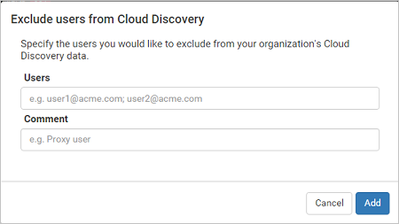
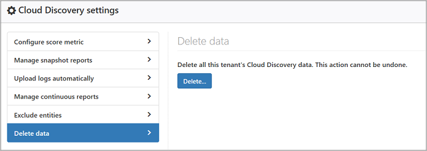

# Início Rápido: Trabalhar com aplicativos descobertos

*Aplica-se a: Microsoft Cloud App Security*

Este guia de início rápido apresenta as informações introdutórias sobre como monitorar e gerenciar aplicativos descobertos. O painel do Cloud Discovery foi projetado para fornecer mais informações sobre como os aplicativos de nuvem estão sendo usados na sua organização. Ele fornece uma visão geral rápida de quais tipos de aplicativos estão sendo usados, os alertas abertos e os níveis de risco dos aplicativos na sua organização. Ele também mostra quem são os principais usuários do aplicativo e fornece um mapa do local da Matriz de Aplicativo. O Painel do Cloud Discovery tem muitas opções para filtrar os dados. A filtragem permite que você gere exibições específicas dependendo do que você está mais interessado usando gráficos de fácil compreensão para apresentar o panorama completo em uma visão geral.

## Examinar o Painel do Cloud Discovery

A primeira coisa que você deve fazer para obter uma visão geral de seus aplicativos do Cloud Discovery é examinar as seguintes informações no Painel do Cloud Discovery:
 
1. Primeiro, examine o uso geral de aplicativos de nuvem em sua organização na **visão geral de alto nível de uso**.

2. Em seguida, aprofunde-se um nível para ver quais são as **principais categorias** usadas na sua organização para cada um dos diferentes parâmetros de uso. Você pode ver quanto dessa utilização é de aplicativos de Sanção.

3. Vá ainda mais fundo e veja todos os aplicativos em uma categoria específica na guia **Aplicativos descobertos**.

4. Você pode ver os **principais usuários e endereços IP** de origem para identificar quais usuários são os mais dominantes nos aplicativos de nuvem na sua organização.
5. Verifique como os aplicativos descobertos se espalham acordo com a localização geográfica (segundo a Matriz) no **mapa de Matriz de Aplicativos**.

6. Por fim, não se esqueça de examinar a pontuação de risco do aplicativo descoberto na **Visão geral de risco do aplicativo**. Verifique o **status de alertas de descoberta** para ver quantos alertas abertos você deve investigar.

## Aprofundar-se nos aplicativos Descobertos

Se você deseja aprofundar-se ainda mais nos dados que o Cloud Discovery fornece, use os filtros para examinar quais aplicativos são arriscados e quais são usados com frequência.

Por exemplo, se você quiser identificar aplicativos de colaboração e de armazenamento de nuvem arriscados usados com frequência, poderá usar a página de aplicativos Descobertos para os aplicativos que você deseja filtrar. Então você pode [cancelar a sanção ou bloqueá-los](governance-discovery.md) da seguinte maneira:

1. Na página **Aplicativos descobertos**, em **Procurar por categoria**, selecione **Armazenamento em nuvem** e **Colaboração**.
2. Em seguida, use os filtros Avançados e defina **Fator de risco de conformidade** como **SOC 2** é igual a **False**
3. Para **Uso**, defina **Usuários** como mais de 50 usuários e **Uso** para **Transações** como mais de 100.
4. Defina o **Fator de risco de segurança** como **Criptografia de dados em repouso** é igual a **Não tem suporte**. Em seguida, defina **Pontuação de risco** como igual a 6 ou menos.

Depois que os resultados são filtrados, você pode [cancelar a sanção e bloqueá-los](governance-discovery.md) usando a caixa de seleção de ação em massa para cancelar a sanção de todos eles em uma ação só. Depois que eles tiverem a sanção cancelada, você poderá usar um script de bloqueio para impedir que sejam usados em seu ambiente.

O Cloud Discovery permite que você se aprofunde ainda mais no uso de nuvem da sua organização. Identifique instâncias específicas que estão em uso investigando os subdomínios descobertos.
     
Por exemplo, você pode diferenciar entre os diferentes sites do SharePoint.

Isso tem suporte apenas em firewalls e proxies que contêm dados de URL de destino. Para obter informações, confira a lista de dispositivos compatíveis em [Proxies e firewalls compatíveis](set-up-cloud-discovery.md#supported-firewalls-and-proxies).

  

## Gerar relatório executivo do Cloud Discovery

A melhor maneira de obter uma visão geral do uso de Shadow IT na organização é gerando um relatório executivo do Cloud Discovery. Este relatório identifica os principais riscos potenciais e ajuda você a planejar um fluxo de trabalho para atenuar e gerenciar os riscos até que eles sejam resolvidos.

Para gerar um relatório executivo do Cloud Discovery: 

No painel do **Cloud Discovery**, clique nos três pontos no canto superior direito do menu e selecione **Gerar relatório executivo do Cloud Discovery**.

## Excluir entidades

Se você tem usuários do sistema, endereços IP ou computadores ruidosos, mas desinteressantes, ou aplicativos que não são relevantes, talvez queira excluir os dados deles dos dados do Cloud Discovery que são analisados. Por exemplo, você talvez queira excluir todas as informações provenientes de 127.0.0.1 ou do host local.  
  
Para criar uma exclusão:  
  
1. No portal, no ícone de configurações, selecione **Configurações de Cloud Discovery**.  
2. Clique na guia **Excluir entidades**.  
3. Escolha a guia **Usuários excluídos**, **Endereços IP excluídos** ou **Computadores excluídos** e clique no botão + para adicionar sua exclusão.
4. Adicione um alias do usuário, um endereço IP ou um nome do computador. É recomendável adicionar informações sobre por que a exclusão foi feita.
  
       
  
## Gerenciar relatórios contínuos

Relatórios contínuos personalizados fornecem maior granularidade ao monitorar os dados de log do Cloud Discovery da sua organização. Ao criar relatórios personalizados, é possível filtrar por localizações geográficas, redes, sites ou unidades organizacionais específicas. Por padrão, somente os relatórios a seguir aparecem no seu seletor de relatório do Cloud Discovery:  
  
- O **Relatório global** consolida todas as informações no portal de todas as fontes de dados incluídas em seus logs.  O relatório global não inclui dados do Microsoft Defender ATP.
  
- O **Relatório específico de fonte de dados** mostra apenas informações para uma fonte de dados específica.  
  
Para criar um novo relatório contínuo:  
  
1. No portal, no ícone de configurações, selecione **Configurações de Cloud Discovery**.  
  
2. Clique na guia **Relatório contínuo**.  
  
3. Clique no botão **Criar relatório**.  
  
4. Insira um nome de relatório.  
  
5. Selecione as fontes de dados que você deseja incluir.  
  
6. Defina os filtros que você deseja nos dados. Esses filtros podem ser **Grupos de usuários**, **Marcas de endereço IP** ou **Intervalos de endereços IP**. Para obter mais informações sobre como trabalhar com marcas de endereço IP e intervalos de endereço IP, consulte [Organizar os dados de acordo com suas necessidades](ip-tags.md).  
  
     

> [!NOTE]
> Todos os relatórios personalizados são limitados a no máximo 1 GB de dados não compactados. Se houver mais de 1 GB de dados, o primeiro GB de dados será exportado para o relatório.

## Excluindo dados do Cloud Discovery

Há uma série de motivos pelos quais você pode desejar excluir seus dados do Cloud Discovery. É recomendável exclui-los nos seguintes casos:  
  
- Se você carregou os arquivos de log manualmente e passou muito tempo antes de atualizar o sistema com novos arquivos de log e você não deseja dados antigos afetando os resultados.  
  
- Quando você define uma nova exibição de dados personalizada, ela será aplicada somente aos novos dados desse ponto em diante. Portanto, você talvez queira apagar os dados antigos e, em seguida, carregar seus arquivos de log novamente para habilitar a exibição de dados personalizada para escolher eventos nos dados do arquivo de log.  
  
- Se vários usuários ou endereços IP tiverem começado a funcionar de novo recentemente após ficarem um período offline, sua atividade será identificada como anômala e poderá gerar violações falso-positivas.  
  
Para excluir os dados do Cloud Discovery:  
  
1. No portal, no ícone de configurações, selecione **Configurações de Cloud Discovery**.  
  
2. Clique na guia **Excluir dados**.  
  
    É importante ter certeza de que deseja excluir os dados antes de continuar. Isso não poderá ser desfeito e excluirá **todos** os dados do Cloud Discovery no sistema.  
  
3. Clique no botão **Excluir**.  
  
      
  
   > [!NOTE]  
   >  O processo de exclusão leva alguns minutos e não é imediato.

## Próximas etapas
 
[Criar instantâneo de relatórios do Cloud Discovery](create-snapshot-cloud-discovery-reports.md)

[Configurar upload de log automático para relatórios contínuos](configure-automatic-log-upload-for-continuous-reports.md)

[Trabalhando com os dados do Cloud Discovery](working-with-cloud-discovery-data.md)

