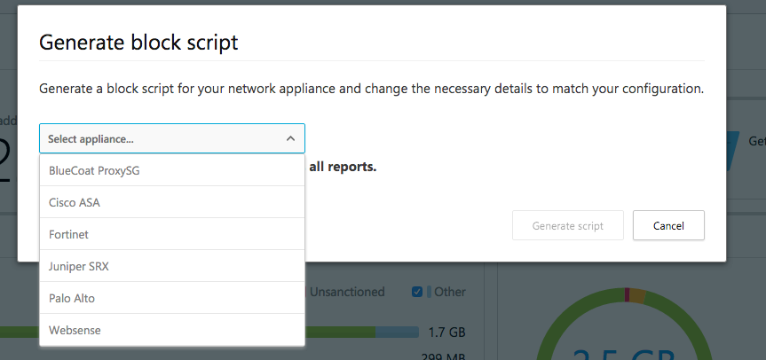

# Controlar aplicativos descobertos

*Aplica-se ao: Microsoft Cloud App Security*

Depois de examinar a lista de aplicativos descobertos em seu ambiente, você pode proteger seu ambiente aprovando aplicativos seguros (**aprovados**) ou proibindo aplicativos indesejados (não**aprovados**) das seguintes maneiras.

##  Sanção/cancelamento de sanção de um aplicativo 

Você pode cancelar a sanção um aplicativo de risco específico clicando nos três pontos no final da linha. Em seguida, selecione **Cancelar sanção**. O cancelamento de sanção de um aplicativo não bloqueia o uso, mas permite monitorar seu uso mais facilmente com os filtros do Cloud Discovery. Em seguida, você pode notificar os usuários do aplicativo não sancionado e sugerir um aplicativo alternativo seguro para seu uso.

  

Se você tiver uma lista de aplicativos que deseja sancionar ou cancelar a sanção, use a caixa de seleção para marcar os aplicativos que deseja gerenciar e, em seguida, selecione a ação.

Para consultar uma lista de aplicativos não sancionados, você pode [gerar um script de bloco usando as APIs do Cloud App Security](https://us.portal.cloudappsecurity.com/api-docs/#generate-block-script).

> [!NOTE]
> Se seu locatário usa o Zscaler NSS, qualquer aplicativo que você marcar como não sancionado é bloqueado automaticamente pelo Cloud App Security, e as seções a seguir em relação à criação de scripts de bloqueio são desnecessárias. Para saber mais, confira [Integração com o Zscaler](zscaler-integration.md).

## Exporte um script de bloqueio para controlar aplicativos descobertos

O Cloud App Security permite que você bloqueie o acesso a aplicativos não sancionados usando os dispositivos de segurança locais existentes. Gere um script de bloqueio dedicado e importe-o para seu dispositivo. Essa solução não exige o redirecionamento de todo o tráfego da Web da organização para um proxy.

1. No painel de Descoberta de nuvem, marque quaisquer aplicativos que você deseja bloquear como **Não sancionados**.

     

2. Na barra de título, clique nos três pontos e selecione **Gerar script de bloqueio...** . 

     

3. Em **Gerar script de bloqueio**, selecione o dispositivo para o qual deseja gerar o script de bloqueio. 

     

4. Em seguida, clique no botão Gerar script para criar um script de bloqueio para todos os aplicativos não sancionados. Por padrão, o arquivo será nomeado com a data em que foi exportado e o tipo de dispositivo selecionado. *2017-02-19_CAS_Fortigate_block_script.txt* é um nome de arquivo de exemplo 

     

5. Importe o arquivo criado para seu dispositivo.

## Próximas etapas  
[Atividades diárias para proteger seu ambiente de nuvem](daily-activities-to-protect-your-cloud-environment.md)   

[Os clientes Premier também podem criar uma nova solicitação de suporte diretamente no Portal Premier.](https://premier.microsoft.com/)  
  
  
