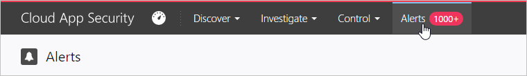

# Alertas
Para exibir alertas:

No portal do Cloud App Security, clique em Alertas.

Depois de observar um alerta, se não for interessante, você poderá **Ignorar**. Você pode inserir um comentário para explicar por que ignorou o alerta e pode **Enviar comentários para a equipe de Cloud App Security**. Esses comentários são revisados por nossa equipe de pesquisa em segurança para melhorar constantemente o mecanismo de alerta. 

Se você investigar o alerta e reduzir o risco, poderá, então, **Resolver** o alerta. O alerta não será mais exibido na tabela de alertas. Se você começou a investigar um problema, mas deseja garantir que se lembrará de continuar, você pode **Marcar como não lido**. Você também pode **Ajustar a política** que correspondeu ao alerta para melhorar as correspondências de alerta futuras. Resolver um alerta também oferece a opção de inserir um comentário e **Enviar comentários para a equipe de Cloud App Security**.

Os seguintes tipos de alertas serão exibidos. 

## Alertas internos

|Nome do alerta|AlertID|Descrição|
|----|----|----|
|Novo local|ALERT_GEOLOCATION_NEW_COUNTRY|Um novo local foi detectado desde o início da verificação (até seis meses). Isso é mostrado apenas uma vez para cada país para toda a sua organização. |
|Novo usuário administrador|ALERT_ADMIN_USER|Foi detectado um novo administrador para um aplicativo específico; isso pode ser alguém que é um administrador em um aplicativo e agora é um administrador em outro. Este alerta relaciona-se ao tipo de administrador específico, por isso ele aparecerá sempre que o tipo de administrador for alterado. Se um usuário perder os privilégios de administrador e obtê-los novamente, esse alerta será exibido.|
|Conta inativa|ALERT_ZOMBIE_USER|Quando um usuário fica inativo por 60 dias por aplicativo (por exemplo, se alguém está ativo no Box, mas não usa o G Suite por 60 dias) o usuário é considerado inativo no G Suite. Uma marca é adicionada a esses usuários para que você possa pequisar contas inativas.|
|Local de administrador inesperado|ALERT_NEW_ADMIN_LOCATION|Um novo local foi detectado para os administradores desde o início da verificação (até seis meses). Isso é mostrado apenas uma vez para cada país para um administrador para toda a sua organização. |
|Conta comprometida|ALERT_COMPROMISED_ACCOUNT|Se ocorrer uma violação em um aplicativo e a lista de contas violadas for publicada, o Cloud App Security baixa a lista e a compara à sua lista de usuários, incluindo usuários internos, usuários externos e contas pessoais. |

## Alertas Personalizados

|Nome do alerta|AlertID|Descrição|
|----|----|----|
|Alerta de atividade suspeita|ALERT_SUSPICIOUS_ACTIVITY|Atividades suspeitas são pontuadas de acordo com o nível de suspeita da atividade anormal (há uma conta inativa envolvida? Trata-se de um novo local?) Esses critérios são calculados juntos para fornecer uma pontuação de risco com base nos seguintes fatores de risco:  O usuário é administrador  Usuário estritamente remoto Proxy anônimo  A sessão inteira é composta por logons com falha Várias falhas de logon Novo (administrador) IP/ISP/país/agente de usuário para usuário/locatário  IP/ISP/país/agente de usuário usado somente pelo usuário (administrador) Primeira atividade de usuário (administrador) em muito tempo Primeira vez que essa atividade administrativa específica é executada em muito tempo Essa atividade administrativa específica não é comum / nunca foi executada antes Esse IP tinha apenas logons com falha no passado Viagem impossível|
|Alerta de uso de nuvem suspeito|ALERT_DISCOVERY_ANOMALY_DETECTION|A detecção de anomalias do Cloud Discovery verifica o padrão de comportamento normal e procura por usuários ou aplicativos que são usados de maneira incomum. |
|Violação de política de atividade|ALERT_CABINET_EVENT_MATCH_AUDIT|Esse alerta informa quando uma correspondência de política foi detectada.|
|Violação de política de arquivos|ALERT_CABINET_EVENT_MATCH_FILE|Esse alerta informa quando uma correspondência de política foi detectada.|
|Violação de política de proxy|ALERT_CABINET_INLINE_EVENT_MATCH|Esse alerta informa quando uma correspondência de política foi detectada.|
|Violação de política de campo|ALERT_CABINET_EVENT_MATCH_OBJECT|Esse alerta informa quando uma correspondência de política foi detectada.|
|Novo serviço descoberto|ALERT_CABINET_DISCOVERY_NEW_SERVICE|Um novo aplicativo foi descoberto.|
|Uso de conta pessoal|ALERT_PERSONAL_USER_SAGE|Com base em nomes de usuário, o mecanismo de detecção procura contas pessoais e compartilhamentos de arquivos. |

## Veja também  
[Atividades diárias para proteger seu ambiente de nuvem](daily-activities-to-protect-your-cloud-environment.md)   
[Para obter suporte técnico, visite a página de suporte assistido do Cloud App Security.](http://support.microsoft.com/oas/default.aspx?prid=16031)   
[Os clientes Premier também podem escolher o Cloud App Security diretamente no Portal Premier.](https://premier.microsoft.com/)  
  
  