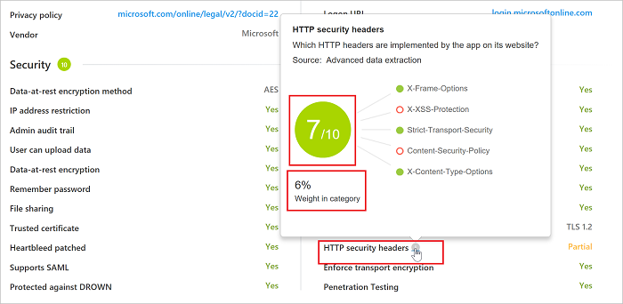

# Trabalhar com pontuações de risco do aplicativo

*Aplica-se ao: Microsoft Cloud App Security*

O Catálogo de Aplicativos de Nuvem fornece uma visão completa do que o Cloud Discovery identifica. O Cloud Discovery analisa seus logs de tráfego com base no catálogo de mais de 16.000 aplicativos de nuvem do Microsoft Cloud App Security. Os aplicativos são classificados e pontuados com base mais de 70 fatores de risco para fornecer visibilidade contínua do uso de nuvem, TI Sombra e o risco que a TI Sombra representa para sua organização. Este artigo fornece instruções sobre como usar e personalizar a pontuação de risco do aplicativo Cloud App Security.

## O catálogo de Aplicativos de Nuvem

O **Catálogo de aplicativos de nuvem** classifica o risco para seus aplicativos de nuvem com base em certificações regulatórias, padrões da indústria e práticas recomendadas. Quatro processos complementares são executados no Catálogo de aplicativos de nuvem para mantê-lo atualizado:
1. Extração de dados automatizada diretamente do aplicativo de nuvem. A extração é para atributos como conformidade com SOC 2, termos de serviço, URL de entrada, política de privacidade e localização da sede.
2. Extração de dados avançada automatizada dos algoritmos do Cloud App Security (para atributos como cabeçalhos de segurança HTTP).
3. Análise contínua da equipe de analistas de nuvem do Cloud App Security (para atributos como criptografia em repouso).
4. Solicitações de revisão baseada no cliente, com base nas solicitações de envio de cliente para alterações no Catálogo de aplicativos de nuvem. Todas as solicitações são revisadas por nossa equipe de analistas de nuvem e atualizadas com base em suas descobertas.
  
  

A demanda por unidades de negócios para aplicativos de nuvem como uma solução para suas necessidades de alteração está aumentando. O catálogo de aplicativos de Nuvem permite que você escolha cuidadosamente quais aplicativos atendem aos requisitos de segurança da sua organização. O catálogo mantém você atualizado com os padrões de segurança, as vulnerabilidades e as violações mais recentes.

Por exemplo, digamos que você queira comparar os aplicativos CRM e garantir que eles sejam adequadamente protegidos. Você pode usar a página de catálogo do aplicativo de Nuvem para filtrar aplicativos relevantes que você deseja:

1. Na página **Catálogo de aplicativos de nuvem**, em **Procurar por categoria**, selecione **CRM**. 
2. Em seguida, use os filtros **Avançados** e defina **Fator de risco de conformidade** para **SOC 2** como igual a **True**.
3. Defina **Fator de risco de conformidade** para **ISO 27001** como igual a **True**.
4. Selecione **Fator de risco de segurança** para **Dados na criptografia em repouso** não é igual a **Não tem suporte** e **N/D**.
5. Defina **Fator de risco de segurança** para **Trilha de auditoria de administrador** como igual a **True**.
6. Selecione **Fator de risco de segurança** para **Trilha de auditoria de usuário** como igual a **True**.

Depois que os resultados são filtrados, você pode examinar os aplicativos relevantes e localizar o que melhor atenda às suas necessidades.

## Filtros do Catálogo de Aplicativos de nuvem

Há filtros básicos e avançados do Catálogo de aplicativos de nuvem. Para criar um filtro complexo, use a opção avançada que inclui todos os seguintes filtros:

- **Marcas de aplicativo**: marcas permitem personalizar o Catálogo de aplicativos de nuvem. 
  Você pode selecionar **Sancionado**, **Não sancionado** ou criar marcas personalizadas para aplicativos. Essas marcas então podem ser usadas como filtros. Os filtros são úteis para aprofundar-se nos tipos específicos de aplicativos que você deseja investigar.
- **Aplicativos e domínios**: permite que você pesquise aplicativos específicos ou aplicativos usados em domínios específicos.
- **Categorias**: o filtro de categorias, localizado à esquerda da página, permite que você pesquise tipos de aplicativos de acordo com as categorias de aplicativo. Por exemplo, aplicativos de rede social, aplicativos de armazenamento em nuvem e mais tipos de aplicativos. Você pode selecionar mais de uma categoria por vez ou uma única categoria. Em seguida, aplique filtros básicos ou avançados sobre as categorias.
- **Fator de risco de conformidade**: permite que você pesquise padrões específicos, certificação e conformidade com os quais o aplicativo pode cumprir. Exemplos incluem HIPAA, ISO 27001, SOC 2 e PCI-DSS.
- **Fator de risco geral**: permite que você pesquise fatores de risco gerais, como a popularidade do consumidor, localidade do data center, entre outros.
- **Fator de risco legal**: permite que você filtre com base em todos os regulamentos e políticas que estão em vigor. Usar fatores de risco ajuda a garantir a proteção de dados e a privacidade dos usuários do aplicativo, como RGPD, DMCA e política de retenção de dados.
- **Pontuação de risco**: permite que você filtre aplicativos por pontuação de risco em que você possa se concentrar. Por exemplo, revisando somente os aplicativos arriscados.
- **Fator de risco de segurança**: habilita você a filtrar com base em medidas de segurança específica. As medidas incluem criptografia em repouso, autenticação multifator e outras.

## Sugerir uma alteração

Se você encontrar um novo aplicativo em seu ambiente que ainda não tenha sido classificado pelo Cloud App Security, poderá solicitar uma análise do aplicativo. Você também pode solicitar uma análise para um novo fator de risco, uma atualização de pontuação ou dados de aplicativo que estejam desatualizados.

**Para sugerir um novo aplicativo:**

1. Na parte superior da página **Aplicativos descobertos**, clique nos três pontos e, em seguida, selecione **Sugerir novo aplicativo**.

   

2. No pop-up **Sugerir novo aplicativo de nuvem**, preencha os detalhes sobre o novo. Inclua o nome e o domínio do aplicativo.

   

3. É recomendável marcar a caixa de seleção para permitir que os analistas do Cloud App Security contatem você caso sejam necessárias informações adicionais sobre o aplicativo. Preencher informações de contato permite que você seja atualizado quando a análise for concluída.

**Para atualizar um fator de risco, uma pontuação ou para atualizar dados de aplicativo:**

1. Na página **Catálogo de aplicativos de nuvem**, na linha de aplicativos que você deseja atualizar, clique nos três pontos no final da linha e selecione **Solicitar atualização de pontuação**.

   

2. No pop-up **Sugerir um aperfeiçoamento**, selecione se você deseja solicitar uma atualização de pontuação, sugerir um novo fator de risco ou atualizar dados de aplicativo.

   

3. É recomendável marcar a caixa de seleção para permitir que os analistas do Cloud App Security contatem você caso sejam necessárias informações adicionais sobre o aplicativo. Preencher informações de contato permite que você seja atualizado quando a análise for concluída.
 
## Personalizar a pontuação de risco

O Cloud Discovery oferece dados importantes com relação à credibilidade e à confiabilidade dos aplicativos de nuvem que são usados em todo o ambiente. No portal, cada aplicativo descoberto é exibido junto com uma pontuação total. A pontuação representa a avaliação do Cloud App Security da maturidade do uso desse aplicativo específico para empresas. A pontuação total de qualquer aplicativo em particular é uma média ponderada de três subtotais relacionados a três subcategorias que o Cloud App Security considera ao avaliar a confiabilidade:  
  
- **Geral** - essa categoria se refere a informações básicas sobre a empresa que produz o aplicativo, incluindo o seu domínio, ano de fundação e popularidade. Esses campos devem mostrar a estabilidade da empresa no nível mais básico.  
  
- **Segurança** – a categoria de segurança considera todos os padrões que lidam com a segurança física dos dados utilizados pelo aplicativo descoberto. Essa categoria inclui campos como autenticação multifator, criptografia, classificação de dados e propriedade dos dados.  
  
- **Conformidade** ‑ Essa categoria exibe quais padrões de conformidade de práticas recomendadas comuns são cumpridos pela empresa que produz o aplicativo. A lista de especificações inclui padrões como HIPAA, CSA e PCI-DSS.  

- **Legal** – Esta categoria exibe quais aplicativos têm quais regulamentos e políticas em vigor para garantir a proteção de dados e a privacidade dos usuários do aplicativo, como o RGPD, o DMCA e a política de retenção de dados.
  
Cada uma das categorias é composta por várias propriedades específicas. De acordo com o algoritmo pontuação do Cloud App Security, cada propriedade recebe uma pontuação preliminar entre 0 e 10, dependendo do valor. Valores Verdadeiro/Falso receberão 10 ou 0 adequadamente. No entanto, propriedades contínuas, como a idade do domínio receberão um determinado valor dentro do espectro. A pontuação de cada propriedade será ponderada em relação a todos os outros campos existentes na categoria para criar o subtotal da categoria. Se você encontrar um aplicativo sem pontuação, isso normalmente indicará um aplicativo cujas propriedades são desconhecidas e, portanto, sem pontuação.  
  
É importante reservar um minuto para examinar e modificar os pesos padrão dados para a configuração de pontuação do Cloud Discovery. Por padrão, todos os vários parâmetros avaliados recebem um peso igual. Se houver determinados parâmetros que são mais ou menos importantes para sua organização, será importante alterá-los da seguinte maneira:  
  
1. No portal, no ícone de configurações, selecione **Configurações de Cloud Discovery**.  
  
2. Em **Métrica de pontuação**, deslize a **Importância** para alterar o peso do campo ou a categoria de risco. A importância pode ser definida como **Ignorada**, **Baixa**, **Média**, **Alta** ou **Muito Alta**.  
  
3. Além disso, você pode definir se determinados valores não estão disponíveis ou não são aplicáveis no cálculo da pontuação. Quando incluídos, valores N/A têm uma contribuição negativa para a pontuação calculada.  
  
     

Todas as informações necessárias para compreender como as classificações de risco do Cloud App Security se comparam estão disponíveis no portal do Cloud App Security. Para melhor compreender o peso de um fator de risco na categoria de risco específico, use o botão "i" à direita de cada nome de campo no perfil do aplicativo. Isso fornece informações sobre exatas como o Cloud App Security pontua um fator de risco específico. A pontuação é o valor do fator de risco em uma escala de 1 a 10 mais o seu peso na categoria de risco:

  
Para compreender o peso de uma categoria risco na pontuação total do aplicativo, passe o mouse sobre a pontuação da categoria de risco:

## Substituindo a pontuação de risco

Para substituir a pontuação de risco, na tabela **Aplicativos descobertos** ou no **Catálogo de aplicativos de nuvem**, clique nos três pontos à direita de qualquer aplicativo e selecione **Substituir a pontuação do aplicativo**.
Você pode substituir a pontuação de risco de um aplicativo sem alterar a maneira como ele é avaliado para que você obtenha resultados imediatos para sua organização. Por exemplo, a pontuação de risco de um aplicativo LOB que você usa é 8. No entanto, o aplicativo é sancionado e incentivado por sua organização. Você talvez queira alterar a pontuação de risco para 10 para o aplicativo de LOB.

Depois de atualizar a pontuação, você pode incluir observações do aplicativo para tornar sua justificativa de negócios para modificar esta pontuação de aplicativo clara para outros administradores. 

Você também pode adicionar observações para tornar a justificativa da alteração clara quando qualquer pessoa analisar o aplicativo.

 
## Próximas etapas
 
[Atividades diárias para proteger seu ambiente de nuvem](daily-activities-to-protect-your-cloud-environment.md)   

[!INCLUDE [Open support ticket](includes/support.md)]  
  
  
