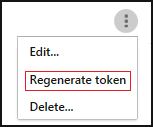

# Integração ao SIEM
    
Agora você pode integrar o Cloud App Security ao seu servidor SIEM para habilitar o monitoramento centralizado de alertas e de atividades. A integração a um serviço SIEM permite que você proteja melhor seus aplicativos na nuvem e, ao mesmo tempo, mantém seu fluxo de trabalho de segurança comum, automatiza os procedimentos de segurança e correlaciona os eventos baseados em nuvem e locais. O agente SIEM do Cloud App Security é executado no servidor e efetua pull de alertas e de atividades do Cloud App Security e transmite-os para o servidor SIEM.

Ao integrar o SIEM primeiro com o Cloud App Security, atividades e alertas dos últimos dois dias serão encaminhadas para o SIEM e todos os alertas e atividades (com base no filtro que você selecionar) daquele momento em diante. Além disso, se você desabilitar esse recurso por um longo período, quando você habilita-o novamente ele encaminhará os últimos dois dias de alertas e atividades e, em seguida, todos os alertas e atividades daquele momento em diante.

A integração ao SIEM é realizada em três etapas:
1. Configurar no portal do Cloud App Security. 
2. Baixar o arquivo JAR e executá-lo no servidor.
3. Validar se o agente SIEM está funcionando

## Pré-requisitos

- Um servidor Windows ou Linux padrão (pode ser uma máquina virtual).
- O servidor deve executar o Java 8. Não há suporte para versões anteriores.

## Integrando ao seu SIEM

### Etapa 1: configurar no portal do Cloud App Security

1. No portal do Cloud App Security, na engrenagem Configurações, clique em **Agentes SIEM**.

2. Clique em Adicionar agente SIEM para iniciar o assistente.
3. No assistente, clique em **Adicionar agente SIEM**.    
4. No assistente, preencha um nome, **Selecione o formato do seu SIEM** e defina as **Configurações avançadas** relevantes do formato. Clique em **Avançar**.

   

5. Digite o endereço IP do **Host do syslog remoto** e o **Número da porta do syslog**. Selecione TCP ou UDP como o protocolo do Syslog Remoto.
Você pode consultar seu administrador de segurança para obter esses detalhes caso ainda não os tenha.
Clique em **Avançar**.
  

6. Selecione quais tipos de dados, **Alertas** e **Atividades** você deseja exportar para o servidor SIEM. Use o controle deslizante para habilitar e desabilitá-los. Por padrão, todas as opções estão marcadas. Você pode usar a lista suspensa **Aplicar a** para definir os filtros para enviarem atividades e alertas específicos ao servidor SIEM.
Você pode clicar em **Editar e visualizar resultados** para verificar se o filtro funciona conforme o esperado. Clique em **Avançar**. 

  

7. Copie o token e salve-o para mais tarde. Depois de clicar em Concluir e sair do Assistente, de volta à página SIEM, você poderá ver o agente SIEM adicionado na tabela. Ele exibirá que foi **Criado** até ser conectado posteriormente.

### Etapa 2: baixar o arquivo JAR e executá-lo no servidor

1. [Baixe o arquivo .zip no Centro de Download da Microsoft](https://go.microsoft.com/fwlink/?linkid=838596) e descompacte-o.

2. Extraia o arquivo .jar do arquivo zip e execute-o no servidor.
 Depois de executar o arquivo, execute o seguinte:
    
      java -jar mcas-siemagent-0.87.20-signed.jar [--logsDirectory DIRNAME] [--proxy ADDRESS[:PORT]] --token TOKEN
> [!NOTE]
> - O nome do arquivo pode ser diferente dependendo da versão do agente SIEM.
> - Parâmetros em colchetes [] são opcionais e devem ser usados somente se relevantes.

Quando as seguintes variáveis são usadas:
- DIRNAME é o caminho para o diretório que você deseja usar para os logs locais de depuração do agente.
- ADDRESS[:PORT] é o endereço do servidor proxy e a porta que o servidor usa para se conectar à Internet.
- TOKEN é o token do agente SIEM copiado na etapa anterior.

Você pode digitar -h a qualquer momento para obter ajuda.

### Etapa 3: validar se o agente SIEM está funcionando

1. Verifique se o status do agente SIEM no portal do Cloud App Security não está como **Erro de Conexão** ou **Desconectado** e se não há nenhuma notificação do agente. Ele será exibido como **Erro de Conexão** se a conexão estiver inativa por mais de duas horas e como **Desconectado**, se a conexão estiver inativa por mais de 12 horas.
 
 
   Em vez disso, o status deve ser conectado, conforme visto aqui:  

2. No servidor Syslog/SIEM, verifique se você pode ver os alertas e as atividades que chegam do Cloud App Security.

## Regenerando o token
Se você perder o token, sempre será possível regenerá-lo clicando nos três pontos ao final da linha do agente SIEM na tabela e selecionando **Regenerar token**.

 

## Editando o agente SIEM 
Se precisar editar o agente SIEM no futuro, você poderá clicar nos três pontos ao final da linha do agente SIEM na tabela e selecionar **Editar**. Se você editar o agente SIEM, não será necessário executar novamente o arquivo .jar; ele será atualizado automaticamente.

## Excluindo o agente SIEM
Se precisar excluir o agente SIEM no futuro, você poderá clicar nos três pontos ao final da linha do agente SIEM na tabela e selecionar **Excluir**.

## Solucionando problemas do agente SIEM

Verifique se o status do agente SIEM no portal do Cloud App Security não está como **Erro de Conexão** ou **Desconectado** e se não há nenhuma notificação do agente. Ele será exibido como **Erro de Conexão** se a conexão estiver inativa por mais de duas horas e como **Desconectado**, se a conexão estiver inativa por mais de 12 horas.

Caso veja algum dos seguintes erros no prompt de comando ao executar o agente, use as seguintes etapas para corrigir o problema:

|Erro do|Descrição|Resolução|
|----|----|----|
|Erro geral durante a inicialização|Erro inesperado durante a inicialização do agente.|Contate o suporte.|
|Muitos erros críticos|Muitos erros críticos durante a conexão ao console. Desligue-o.|Contate o suporte.|
|Token inválido|O token fornecido não é válido.|Verifique se você copiou o token correto. Você pode usar o processo acima para regenerar o token.|
|Endereço de proxy inválido|O endereço de proxy fornecido não é válido.|Verifique se você inseriu o proxy e a porta corretos.|

Depois de criar o agente, se você vir uma das seguintes **Notificações do agente** no portal do Cloud App Security na página do agente SIEM, use as seguintes etapas para corrigir o problema:

|Erro do|Descrição|Resolução|
|----|----|----|
|**Erro interno**|Algo desconhecido deu errado com o agente SIEM.|Contate o suporte.|
|**Erro de envio do servidor de dados**|Você poderá receber esse erro se estiver trabalhando com um servidor Syslog sobre TCP. O agente SIEM não pode se conectar ao servidor Syslog.  Se você receber esse erro, o agente parará de efetuar pull de novas atividades até a correção do problema, portanto não se esqueça de seguir as etapas de correção até o erro desaparecer.|1. Verifique se você definiu corretamente o servidor Syslog: na interface do usuário do Cloud App Security, edite o agente SIEM conforme descrito acima e verifique se você escreveu o nome do servidor corretamente e definiu a porta correta.  2. Verifique a conectividade com o servidor Syslog: verifique se o firewall não está bloqueando a comunicação.| 
|**Erro de conexão do servidor de dados**| Você poderá receber esse erro se estiver trabalhando com um servidor Syslog sobre TCP. O agente SIEM não pode se conectar ao servidor Syslog.  Se você receber esse erro, o agente parará de efetuar pull de novas atividades até a correção do problema, portanto não se esqueça de seguir as etapas de correção até o erro desaparecer.|1. Verifique se você definiu corretamente o servidor Syslog: na interface do usuário do Cloud App Security, edite o agente SIEM conforme descrito acima e verifique se você escreveu o nome do servidor corretamente e definiu a porta correta.  2. Verifique a conectividade com o servidor Syslog: verifique se o firewall não está bloqueando a comunicação.|
|**Erro do agente SIEM**|O agente SIEM está desconectado há mais de X horas|Verifique se você não alterou a configuração do SIEM no portal do Cloud App Security. Caso contrário, isso pode indicar problemas de conectividade entre o Cloud App Security e o computador no qual você está executando o agente SIEM.|
|**Erro de notificação do agente SIEM**|A notificação do agente SIEM encaminha erros que foram recebidos de um agente SIEM.|Isso indica que você recebeu erros relacionados à conexão entre o agente SIEM e o servidor SIEM. Verifique se não há um firewall bloqueando o servidor SIEM ou o computador no qual o agente SIEM está sendo executado. Além disso, verifique se o endereço IP do servidor SIEM não foi alterado.|

> [!NOTE]
> Esse recurso está em visualização pública.

## Veja também  
[Políticas de atividade de usuário](user-activity-policies.md)   
[Para obter suporte técnico, visite a página de suporte assistido do Cloud App Security.](http://support.microsoft.com/oas/default.aspx?prid=16031)   
[Os clientes Premier também podem escolher o Cloud App Security diretamente no Portal Premier.](https://premier.microsoft.com/)  
  
  