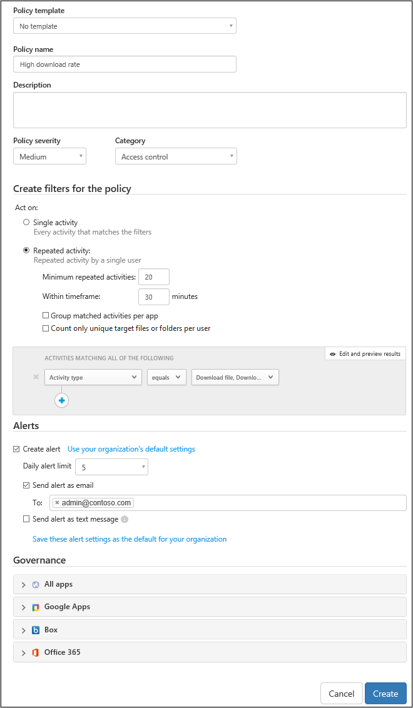

*Aplica-se ao: Microsoft Cloud App Security*

# Políticas de atividade
As políticas de atividade permitem que você aplique uma ampla gama de processos automatizados, utilizando as APIs do provedor de aplicativo. Essas políticas permitem que você monitore atividades específicas realizadas por vários usuários ou siga altas taxas inesperadas de um determinado tipo de atividade.  
  
Depois de definir uma política de detecção de atividades, ele começará a gerar alertas, os quais são gerados apenas em atividades que ocorrem depois da criação da política.
  
  
## Alertas personalizados  
As políticas de atividade permitem que você defina alertas personalizados para serem enviados ou ações para serem realizadas quando a atividade do usuário é detectada. Por exemplo, se você quiser saber sempre que um usuário tenta fazer logon e falha 70 vezes em um minuto ou se um usuário baixa 7.000 arquivos ou se conecta do Afeganistão, você poderá definir alertas de atividade a serem enviados para você ou para o usuário quando esses eventos ocorrerem. Você pode até mesmo suspender o usuário até ter tempo de investigar o que ocorreu.  
  
Para criar uma nova política de atividade, siga este procedimento:  
  
1.  No console, clique em **Controlar** seguido por **Políticas**.  
  
2.  Clique em **Criar política** e selecione **Política de atividade**.  
  
       
  
3.  Atribua um nome e uma descrição à sua política. Se desejar, poderá baseá-la em um modelo. Para obter mais informações sobre modelos de política, consulte [Controlar aplicativos de nuvem com políticas](control-cloud-apps-with-policies.md).  
  
4.  Para definir quais ações ou outras métricas vão disparar essa política, trabalhe com os **filtros de atividade**.  
  
5.  Em **Parâmetros de correspondência de atividade**, selecione se a violação da política será disparada quando uma única atividade corresponder aos filtros ou se uma violação será detectada apenas quando um número especificado de **Atividades repetidas** for detectado.  
    Se você escolher **Atividade repetida**, será possível definir **Agrupar atividades correspondentes por aplicativo**. Isso vai disparar uma correspondência de política apenas quando as atividades repetidas ocorrerem no mesmo aplicativo (por exemplo, cinco downloads do Box).  
  
6.  Configure as **Ações** que devem ser executadas quando uma correspondência for encontrada.  
  
Veja esses exemplos:  
  
-   Vários logons com falha  
  
     Você pode definir sua política para que receba um alerta quando houve um grande número de tentativas de logon com falha dentro de um determinado período relativamente curto. Para configurar uma política assim, escolha o filtro de atividade apropriado na página **Nova Política de Atividade**.  
  
     No campo **Filtros de atividade**, configure os parâmetros para os quais o alerta será disparado.  
  
       
  
-   Alta taxa de downloads  
  
     Você pode definir a política para que você receba um alerta quando houve um nível inesperado ou não característico de atividade de download. Para configurar uma política assim, nos parâmetros **Taxa**, escolha os parâmetros para disparar o alerta.  
  
       
  
  
## Referência de política de atividade  
Esta seção fornece detalhes de referência sobre as políticas, fornecendo explicações sobre cada tipo de política e os campos que podem ser configurados para cada política.  
  
Uma **Política de atividade** é uma política baseada em API que permite que você monitore as atividades da sua organização na nuvem, considerando mais de 20 filtros de metadados de arquivo (incluindo o tipo de dispositivo e o local). Com base nos resultados de política, as notificações podem ser geradas e os usuários podem ser suspensos do aplicativo de nuvem.   
Cada política é composta pelas seguintes partes:  
  
- Filtros de atividade – permitem criar condições muito granulares com base nos metadados.  
  
- Parâmetros de correspondência de atividade – permitem que você defina um limite para o número de vezes que uma atividade se repete para ser considerada como correspondente à política.  Especifique o número de atividades repetidas necessário para corresponder à política, por exemplo, definindo uma política para alertar quando um usuário executa dez tentativas de logon sem êxito em um período de dois minutos.  Por padrão, a configuração **Parâmetros de correspondência de atividade** gera uma correspondência para cada atividade que atende a todos os filtros de atividade.   
  Usando **Atividade repetida**, você pode definir o número de atividades repetidas, a duração do período em que as atividades são contadas e até mesmo especificar que todas as atividades devem ser executadas pelo mesmo usuário e no mesmo aplicativo de nuvem.  
  
  
- Ações – a política fornece a um conjunto de ações de governança que podem ser aplicadas automaticamente quando violações são detectadas.  
  ## Consulte Também  
  [Políticas de proteção de dados](data-protection-policies.md)   

[Os clientes Premier também podem escolher o Cloud App Security diretamente no Portal Premier.](https://premier.microsoft.com/)  
  
  